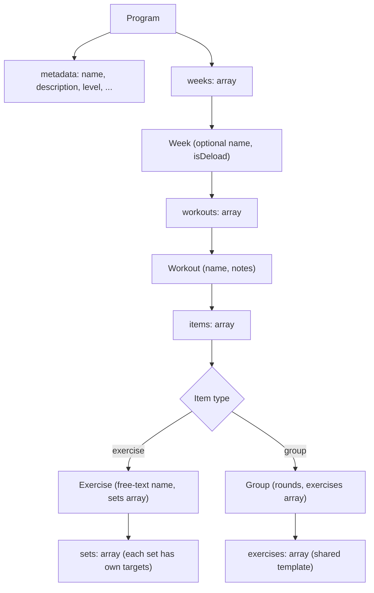
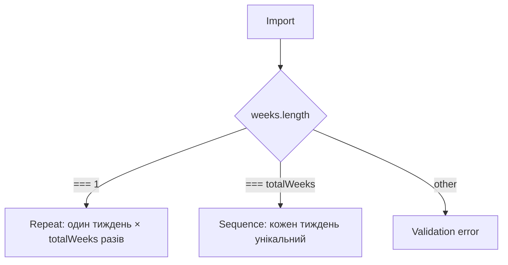
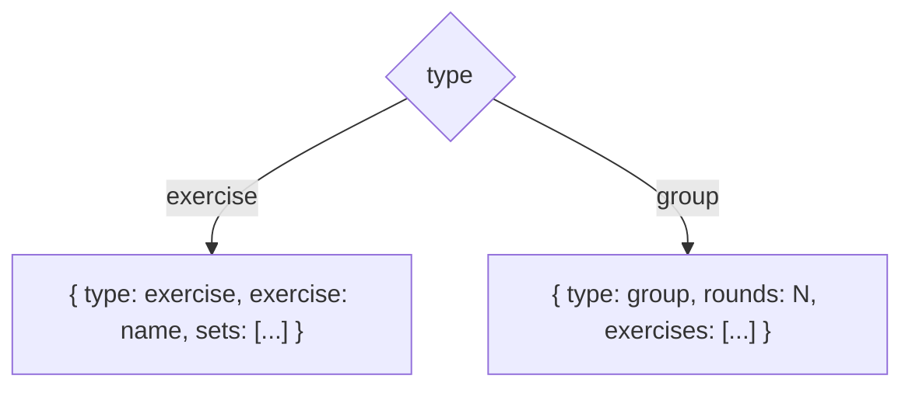
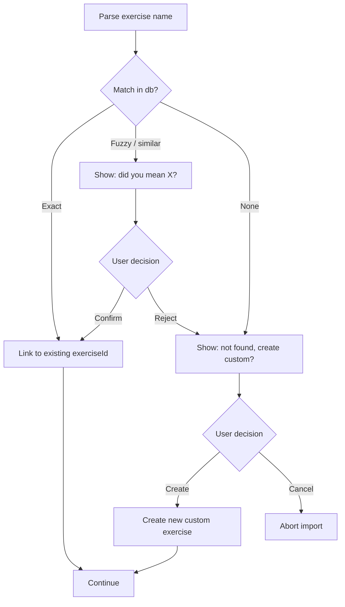

# Gym Tracker · Program Format

> ⚠️ **Status: Frozen — deferred to v2.** Програмний шар повністю винесений з v1. v1 застосунок працює з ad-hoc workout-ами (див. `gym-tracker-spec.md`), без поняття "програма". Цей документ зберігається як reference для майбутнього v2 — формат уже спроектований і не потребує перепродумування коли програми повернуться. UI імпорту також відкладено у v2.

> JSON-формат для імпорту/експорту програм. Один формат обслуговує: ручний імпорт, шаринг між юзерами, бекап, ШІ-генерацію. Технічні вимоги — у `gym-tracker-tech.md`.

**Статус**: формат зафіксовано на рівні полів і правил. UI імпорту і conflict resolution — окрема робота. Імплементація — v2.

**Версія**: v0.1 · `schemaVersion: 1` · frozen

---

## 1. Огляд

Формат описує програму тренувань як **дерево**: програма → тижні → тренування → елементи (вправа або група) → сети.

Основні принципи:

- Сети задаються **без таргет-ваги**, тільки структурою (повтори + опціональний RPE). Юзер сам підбирає вагу під час тренування
- Прогресія між тижнями — **явна, без формул**. Якщо тижні різні, автор пише кожен окремо
- Вправи задаються як **вільний текст** — імпортер мапить на exercise database через conflict resolution
- Усі додаткові поля **опціональні**. Мінімальна валідна програма містить лише назву, тижні, тренування, вправи, повтори
- Невідомі поля **ігноруються** при парсингу — це дозволяє додавати нові поля у майбутніх версіях формату без поломки старих імпортерів



---

## 2. Top-level структура

```json
{
  "schemaVersion": 1,
  "metadata": { ... },
  "weeks": [ ... ]
}
```

| Поле | Тип | Обов'язкове | Опис |
|------|-----|-------------|------|
| `schemaVersion` | integer | так | Версія формату. Зараз `1` |
| `metadata` | object | так | Назва, опис, теги — див. §3 |
| `weeks` | array | так | Масив тижнів — див. §4 |

---

## 3. Metadata

```json
{
  "name": "PPL Beginner",
  "description": "Push/Pull/Legs split, 4 weeks, 3x/week",
  "author": "Andriy",
  "level": "beginner",
  "frequencyPerWeek": 3,
  "totalWeeks": 4,
  "tags": ["hypertrophy", "split"]
}
```

| Поле | Тип | Обов'язкове | Опис |
|------|-----|-------------|------|
| `name` | string | так | Назва програми, відображається в списку |
| `description` | string | ні | Короткий опис, відображається на превʼю перед стартом |
| `author` | string | ні | Автор. Може бути будь-яким рядком |
| `level` | enum | ні | `"beginner"`, `"intermediate"`, `"advanced"` |
| `frequencyPerWeek` | integer | ні | Скільки тренувань на тиждень рекомендовано (для фільтрів). Має узгоджуватись з `workouts.length` у тижні |
| `totalWeeks` | integer | ні | Скільки реальних тижнів триває програма. Якщо опущено — береться `weeks.length` |
| `tags` | string[] | ні | Вільні теги для майбутнього пошуку: `"strength"`, `"hypertrophy"`, `"home"`, `"gym"`, тощо |

---

## 4. Weeks: pattern repeat vs sequence

Масив `weeks` підтримує два режими, обумовлені своєю довжиною:



**Режим repeat** — `weeks.length === 1`, програма повторює цей тиждень `totalWeeks` разів. Підходить для більшості початкових програм (PPL, Upper/Lower) де тижні структурно однакові.

**Режим sequence** — `weeks.length === totalWeeks`, кожен тиждень прописаний окремо. Підходить для програм з прогресією (5/3/1, Smolov, програми з deload).

**Інші значення** — помилка валідації. Зокрема, не підтримується "повтор патерна з 2 тижнів × 6 разів" — автор має розгорнути в усі 12 тижнів.

### 4.1 Структура одного тижня

```json
{
  "name": "Week 3 — heavy",
  "isDeload": false,
  "workouts": [ ... ]
}
```

| Поле | Тип | Обов'язкове | Опис |
|------|-----|-------------|------|
| `name` | string | ні | Назва тижня. Якщо опущено — береться `"Week N"` |
| `isDeload` | boolean | ні | Маркер що це deload-тиждень. Впливає на статистику (не рахується для PR), на UI (показує позначку). Default `false` |
| `workouts` | array | так | Масив тренувань цього тижня — див. §5 |

---

## 5. Workout

Одне тренування дня.

```json
{
  "name": "Push day",
  "notes": "Warm up 5 min on treadmill before bench",
  "items": [ ... ]
}
```

| Поле | Тип | Обов'язкове | Опис |
|------|-----|-------------|------|
| `name` | string | так | Назва тренування. "Push day", "Day 1", "Heavy upper" |
| `notes` | string | ні | Author note для юзера, відображається перед стартом тренування |
| `items` | array | так | Масив елементів: вправа або група — див. §6 |

---

## 6. Items: exercise vs group

Кожен елемент в `items` — або одиночна вправа, або група вправ (суперсет). Розрізняється полем `type`.



### 6.1 Exercise (одиночна вправа)

```json
{
  "type": "exercise",
  "exercise": "Bench press",
  "notes": "Pause 1 sec at chest",
  "restBetweenSets": 180,
  "isBodyweight": false,
  "sets": [
    { "reps": 8, "rpe": 7 },
    { "reps": 8, "rpe": 7 },
    { "reps": 8, "rpe": 8 },
    { "reps": 8, "rpe": 8 }
  ]
}
```

| Поле | Тип | Обов'язкове | Опис |
|------|-----|-------------|------|
| `type` | `"exercise"` | так | Дискримінатор |
| `exercise` | string | так | Назва вправи вільним текстом. Імпортер мапить на db — див. §8 |
| `notes` | string | ні | Author note для цієї вправи |
| `restBetweenSets` | integer | ні | Секунди відпочинку. Default з settings |
| `isBodyweight` | boolean | ні | Якщо `true` — у numpad-і ховається kg-поле. Default `false` |
| `sets` | array | так | Масив сетів — див. §7. Кожен сет має власні таргети |

### 6.2 Group (суперсет)

```json
{
  "type": "group",
  "rounds": 3,
  "restBetweenRounds": 120,
  "notes": "Minimize rest between A1 and A2",
  "exercises": [
    {
      "exercise": "Pull-ups",
      "isBodyweight": true,
      "reps": 8
    },
    {
      "exercise": "Incline push-ups",
      "isBodyweight": true,
      "reps": [10, 15]
    }
  ]
}
```

| Поле | Тип | Обов'язкове | Опис |
|------|-----|-------------|------|
| `type` | `"group"` | так | Дискримінатор |
| `rounds` | integer | так | Кількість раундів. 2–10 (типово 3–4) |
| `restBetweenRounds` | integer | ні | Секунди відпочинку між раундами. Default з settings |
| `notes` | string | ні | Author note для групи |
| `exercises` | array | так | 2–5 вправ у групі. Кожна виконується раз за раунд |

**Group exercise** (елемент масиву `exercises` у групі):

| Поле | Тип | Обов'язкове | Опис |
|------|-----|-------------|------|
| `exercise` | string | так | Назва вправи |
| `notes` | string | ні | Author note для цієї вправи в межах групи |
| `isBodyweight` | boolean | ні | Як у звичайній вправі |
| `reps` | number \| [min, max] | так | Цільові повтори. Один шаблон на всі раунди |
| `rpe` | number 1–10 | ні | Цільовий RPE |

**Чому в групі немає `sets`-масиву.** Усі вправи групи мають однакову кількість раундів (= `rounds`) — це обмеження зафіксоване в моделі. Кожен раунд — це один прохід через всі вправи. Тому замість списку сетів — один шаблон, який повторюється `rounds` разів. Спроба написати уневен сети просто неможлива в форматі.

---

## 7. Set

Один сет одиночної вправи.

```json
{
  "reps": 8,
  "rpe": 8,
  "isWarmup": false,
  "notes": "Last set: AMRAP if feeling good"
}
```

| Поле | Тип | Обов'язкове | Опис |
|------|-----|-------------|------|
| `reps` | number \| [min, max] | так | Цільові повтори. `8` або `[8, 12]` для ranges. Range коректний коли `min < max`, обоє `> 0` |
| `rpe` | number | ні | Цільовий RPE 1–10. Десяткові дозволені (`8.5`) |
| `isWarmup` | boolean | ні | Маркер що сет — розминка. Виключається з volume і PR detection. Default `false` |
| `notes` | string | ні | Author note для цього сета |

**Чому немає поля для ваги.** Зафіксоване рішення: програми визначають структуру, не вагу. Юзер сам підбирає вагу під час тренування орієнтуючись на `prev` (минуле тренування) і RPE-таргет.

**Що з RIR.** Не підтримується. Усе internal — RPE.

**Що з tempo.** Не підтримується окремим полем. Якщо автор хоче — пише в `notes` вправи: `"Tempo 3-1-1-0"`.

---

## 8. Conflict resolution на імпорті

Вправи в форматі — вільний текст. На імпорті застосунок мапить кожну назву на exercise database (системну + кастомну).



**Exact match** — точна збіжність назви (case-insensitive, ignore leading/trailing spaces).

**Fuzzy match** — близька назва (Levenshtein distance ≤ 2 символи, або substring match). Наприклад: `"Bench press"` ↔ `"Bench Press"`, `"Pullups"` ↔ `"Pull-ups"`. Юзер підтверджує.

**No match** — пропонується створити кастомну вправу з цією назвою.

UI цього флоу — окрема робота, не у форматі. Поточний документ описує тільки **що** мапиться, не **як** показується.

---

## 9. Validation rules

При імпорті JSON застосунок перевіряє:

| Правило | Помилка |
|---------|---------|
| `schemaVersion` присутнє і відоме | "Unsupported schema version" |
| `metadata.name` непорожній | "Program must have a name" |
| `weeks.length === 1 \|\| weeks.length === totalWeeks` | "Weeks count doesn't match totalWeeks" |
| Кожен тиждень має `workouts.length >= 1` | "Week must have at least one workout" |
| Кожне тренування має `items.length >= 1` | "Workout must have at least one exercise" |
| У групі `exercises.length` між 2 і 5 | "Group must have 2 to 5 exercises" |
| У групі `rounds` між 2 і 10 | "Group must have 2 to 10 rounds" |
| Кожна вправа має `sets.length >= 1` (regular) або `reps` (group) | "Exercise must have at least one set" |
| `reps` — позитивне число або `[min, max]` де `min < max`, обоє > 0 | "Invalid reps value" |
| `rpe` між 1 і 10 (включно) | "RPE must be between 1 and 10" |

Невідомі поля ігноруються (forward compatibility). Дублікати в array-ах допускаються (юзер може хотіти 3 однакові вправи в одному дні — ідентичні warmup-сети, наприклад).

---

## 10. Повний приклад

Реалістична PPL програма, 4 тижні, останній тиждень — deload. Pattern: `sequence`.

```json
{
  "schemaVersion": 1,
  "metadata": {
    "name": "PPL Beginner with Deload",
    "description": "Push/Pull/Legs, 3 weeks of progression + 1 deload week",
    "author": "Andriy",
    "level": "beginner",
    "frequencyPerWeek": 3,
    "totalWeeks": 4,
    "tags": ["hypertrophy", "ppl"]
  },
  "weeks": [
    {
      "name": "Week 1",
      "workouts": [
        {
          "name": "Push day",
          "items": [
            {
              "type": "exercise",
              "exercise": "Bench press",
              "restBetweenSets": 180,
              "sets": [
                { "isWarmup": true, "reps": 10 },
                { "reps": 8, "rpe": 7 },
                { "reps": 8, "rpe": 7 },
                { "reps": 8, "rpe": 8 },
                { "reps": [6, 8], "rpe": 8.5 }
              ]
            },
            {
              "type": "group",
              "rounds": 3,
              "restBetweenRounds": 120,
              "exercises": [
                { "exercise": "Pull-ups", "isBodyweight": true, "reps": [6, 10] },
                { "exercise": "Incline push-ups", "isBodyweight": true, "reps": [10, 15] }
              ]
            }
          ]
        },
        { "name": "Pull day", "items": [ "..." ] },
        { "name": "Leg day", "items": [ "..." ] }
      ]
    },
    { "name": "Week 2", "workouts": [ "..." ] },
    { "name": "Week 3", "workouts": [ "..." ] },
    {
      "name": "Week 4 — Deload",
      "isDeload": true,
      "workouts": [ "..." ]
    }
  ]
}
```

---

## 11. Що зафіксовано — чеклист

- [x] `schemaVersion: 1` як корінь
- [x] Сети без `targetWeight`, тільки структура
- [x] Reps — `number` або `[min, max]`
- [x] RPE only, без RIR (range 1–10, опціонально)
- [x] Прогресія через explicit weeks, без формул
- [x] `weeklyPattern` через довжину масиву (1 = repeat, totalWeeks = sequence)
- [x] Опціональний `isDeload` на рівні тижня
- [x] Author notes на 3 рівнях: program, workout, exercise (без per-set)
- [x] Tempo — не у форматі, тільки в exercise notes якщо потрібно
- [x] Substitutions — не у форматі (generic Replace exercise + ШІ враховує availableEquipment)
- [x] Вправи — вільний текст з conflict resolution на імпорті
- [x] Groups: `rounds` + спільний шаблон, не масив сетів
- [x] Невідомі поля ігноруються (forward compat)

---

## 12. Відкриті питання

UI імпорту, conflict resolution, validation feedback, deep link landing, multi-language програми і edit після import — були спроектовані разом з v0.4 spec-у. Поточний spec (v0.5) ці зони не містить — програмний шар відкладено у v2.

Лишаються:

- **Versioning і backward compat** — як еволюціонувати формат з v1 на v2 без поломки старих експортів. Спрощений принцип: невідомі поля ігноруються (forward compat). `schemaVersion` mismatch у бік newer — dead-end на імпорті. Деталі стратегії міграцій — TBD коли з'явиться v2
- **`availableEquipment` user setting** — окреме поле в settings для майбутньої ШІ-генерації, треба зафіксувати в `gym-tracker-tech.md`
