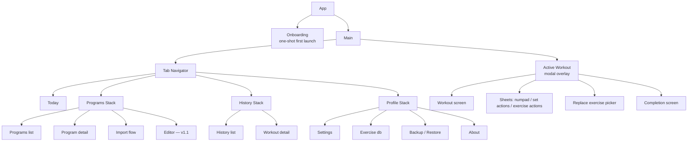
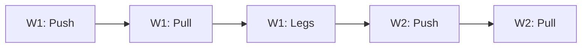
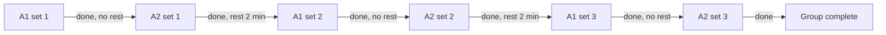
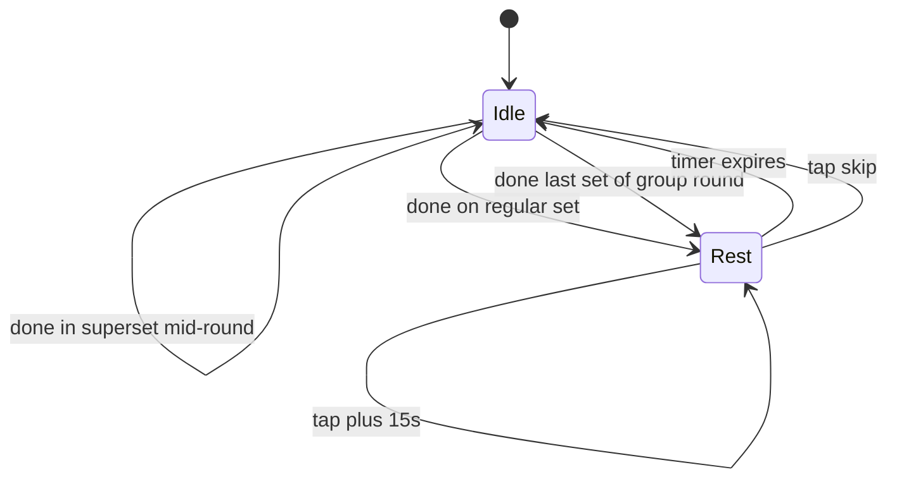
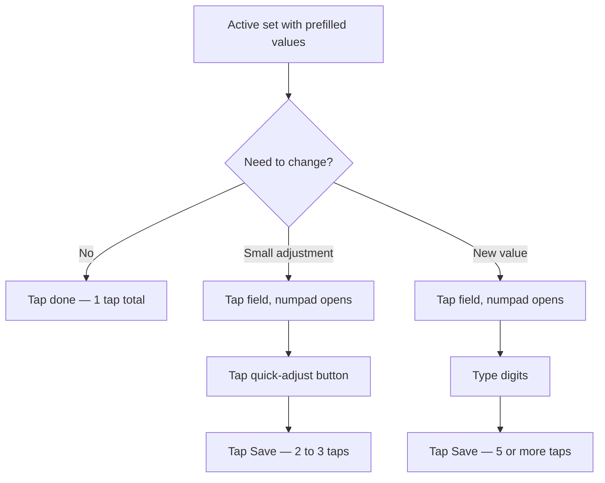
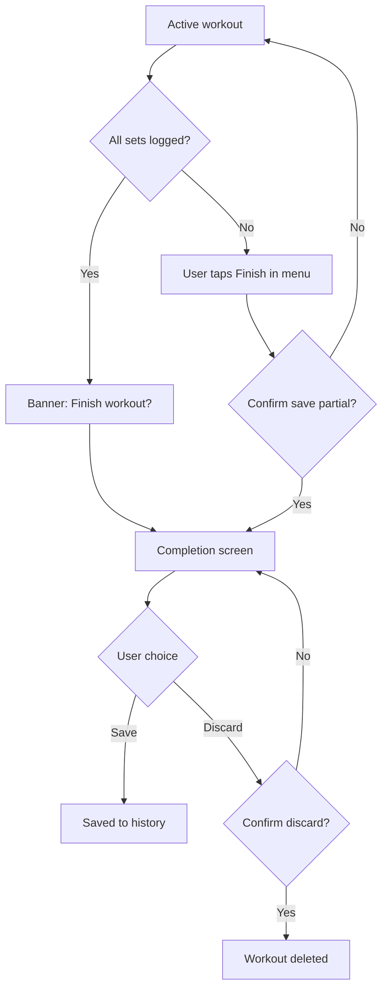
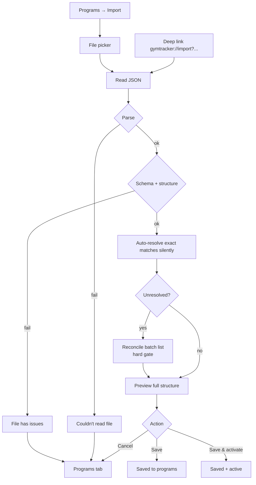

# Gym Tracker · UI/UX Specification

> Трекер тренувань у спортзалі для React Native (iOS + Android). Поточна програма, створення / імпорт / експорт програм, детальне логування прогресу під час тренування.

**Status**: navigation + pre-workout + in-workout + import зони готові концептуально. Відкритий список — у §10.

**Версія**: v0.3 · додано Import flow

---

## 1. Базові принципи

- React Native, кросплатформенний (iOS + Android)
- Цільовий контекст — людина в спортзалі: одна рука, потіє, 5–15 секундні взаємодії між сетами, 15–30 циклів "глянув → залогував → відклав" за тренування
- Власна візуальна мова, не клонуємо Hevy / Strong / Boostcamp
- MVP-філософія: суперсети — це фішка і must-have, AMRAP / drop sets / cluster — відкладено в v2

З цього випливають базові обмеження для in-workout UI:

- Великі тач-таргети (палець, не курсор)
- Мінімум тапів на сет
- Читабельність на відстані витягнутої руки
- Очевидний "де я зараз" з одного погляду
- Темна тема обов'язкова

---

## 2. Навігація / IA

### 2.1 Top-level каркас

4 bottom tabs:

| Tab | Зміст |
|-----|-------|
| **Today** | Активне тренування дня з активної програми + старт. Empty state коли нема активної |
| **Programs** | Список юзерських програм, активна, browse/import, перегляд деталей |
| **History** | Минулі тренування хронологічно, деталь, фільтри |
| **Profile** | Settings, exercise database, backup/restore, delete data, about |

Exercise database живе всередині Profile (а не як окремий 5-й таб). Profile — generic hub для усього що не workout / programs / history.

### 2.2 Active workout — modal full takeover

In-workout екран — modal поверх tab navigator. Tab bar ховається. Вийти можна тільки через свідому дію: `Finish` або `Discard`.

Свідома відмова від mini-bar / minimize-режиму:

- Максимальний фокус, нема відволікань
- Простіша архітектура, менше edge cases
- Втрачаємо швидкий перегляд exercise db / history з-під тренування — але `prev` колонка і replace exercise picker уже покривають 80% таких потреб inline

App backgrounded → state preserved → при поверненні відкривається на тому ж місці. Старт нового workout-у при активному → prompt "Finish or discard current first".

### 2.3 One active program at a time

Юзер має максимум одну активну програму. Switch — у Programs табі. Today показує контекст саме активної.

**Per-program pointer** — кожна програма пам'ятає свій `nextWorkoutPointer`. Switch між програмами не обнуляє прогрес: "PPL → 5/3/1" → пізніше "5/3/1 → PPL" повертає до того ж workout-у в PPL. Невелика ціна по storage за помітно кращий UX.

### 2.4 Дерево навігації



Today — single screen без stack. Решта табів мають свої стеки.

---

## 3. Pre-workout flow

### 3.1 Перша програма — bundled + import

В MVP:

- 2–3 готові bundled програми зашиті в застосунок (контент — окрема робота)
- Import через deep link / file / paste
- Editor — у v1.1 (не блокує MVP)

Bundled програми read-only до v1.1. Юзер що хоче замінити вправу робить це через `Replace exercise` мід-тренування. Коли з'явиться editor — bundled можна форкнути і редагувати копію.

Чому не editor у MVP: editor — велика робота сама по собі (CRUD сетів / груп / днів / тижнів, exercise picker, валідація), а bundled покриває "ввімкнув і тренуйся" сценарій.

### 3.2 Linear progression

Програма — лінійна послідовність workout-ів через всі тижні. Активна програма має `nextWorkoutPointer` що інкрементиться після завершення тренування.



- Today показує `program.workouts[nextWorkoutPointer]`
- Юзер пропустив 3 дні → next workout той самий, що й був
- Тиждень у форматі — організаційна одиниця, не календарний тиждень
- Програма не диктує "Push в понеділок". Юзер тренується тоді коли тренується

Calendar-based scheduling — свідомо не робимо. Реалістично юзери пропускають дні, мандрують, хворіють — linear модель толерує це натуральніше.

### 3.3 Today — shape

Today — expanded preview наступного тренування з sticky `Start workout` внизу.

```
┌─────────────────────────┐
│ Today              ⋯    │  top bar
├─────────────────────────┤
│                         │
│  Push day               │  heading
│  Week 1 · Workout 3/12  │  context
│                         │
│  ┌───────────────────┐  │
│  │ In-progress       │  │  banner (only if applicable)
│  │ Resume · Discard  │  │
│  └───────────────────┘  │
│                         │
│  Bench press         ⌄  │  exercise (collapsed)
│  4 sets · 8 · RPE 7-8   │
│                         │
│  ─ Superset · 3 rounds  │  group label
│  A1 Pull-ups         ⌄  │
│  A2 Incline push-ups ⌄  │
│                         │
│  Squat               ⌄  │
│  3 × [6-8] · RPE 8      │
├─────────────────────────┤
│  [  Start workout  ]    │  sticky bottom
└─────────────────────────┘
```

`⋯` меню top bar:

- Switch program → Programs tab
- Skip this workout → інкрементить pointer без логування (з confirmation)
- View program details → перегляд активної програми

### 3.4 Today — density

Minimal. Без streak counters, без last-workout summary cards, без motivation accents:

- Streak push до тренування "щоб не зламати streak" — антипатерн для health-aware tracker-а. Юзер може бути травмований і має відпочити
- Last workout summary дублює History tab і додає шум на головному екрані
- Progress bar активної програми — нічого не дає юзеру в момент перед тренуванням

Якщо в реальному використанні стане очевидно що чогось бракує — додамо в v1.x.

### 3.5 Exercise preview — one-liner + expand

За замовчуванням кожна вправа в списку — одно-рядковий summary. Тап розкриває повний список сетів (read-only, без редагування).

Формати one-liner:

| Випадок | Приклад |
|---------|---------|
| Усі сети однакові | `Bench press · 4 sets · 8 reps · RPE 7-8` |
| Reps range | `Squat · 3 × [6-8] · RPE 8` |
| Mixed sets | `Bench press · 4 sets, mixed` |
| Bodyweight | `Pull-ups · 3 sets · [6-10]` (без kg) |

Експанд показує таблицю по сетах: `№ | reps | rpe`. Без `prev` (це in-workout концепт, не preview).

Для груп: заголовок групи (`Superset · 3 rounds`) + вкладені вправи з префіксами A1/A2/A3.

### 3.6 Onboarding — straight to picker

Перший запуск:

1. App launches
2. Pick your first program screen — bundled list + `Import from file/link`
3. Tap → Today заповнено → юзер може стартувати

Без welcome screens, без feature tour, без вибору мови (auto-detect з locale), без вибору юнітів (kg в MVP). Onboarding — функціональний, не маркетинговий.

### 3.7 Empty state — Today без активної програми

Коли немає активної (юзер видалив, на старті без вибраної):

```
┌─────────────────────────┐
│ Today                   │
├─────────────────────────┤
│                         │
│         ◯               │  simple illustration
│                         │
│   No active program     │
│                         │
│ Pick one to start       │
│ tracking your workouts  │
│                         │
│  [ Browse programs ]    │  primary → Programs tab
│                         │
└─────────────────────────┘
```

Browse programs button веде в Programs tab, focused state на picker.

### 3.8 Crash restoration — banner

Якщо застосунок закрили мід-тренування (kill, crash, force-quit), при відкритті:

- Юзер landить на Today як завжди
- На Today показується banner "In-progress workout · Resume · Discard"
- Resume → modal active workout відкривається з збереженим state
- Discard → workout прибирається (з confirmation)

Свідомо НЕ auto-resume: ризик попасти в забуте старе тренування одразу при відкритті. Banner — explicit choice, мінімальна friction (один tap до Resume).

### 3.9 Switch active program

Flow:

1. Programs tab → список, поточна active має бейдж `Active`
2. Тап на іншу → program detail screen
3. Primary `Set as active` → активується, повертає на Today

Без destructive confirmation — це не deletion. Switch назад завжди можливий, кожна програма зберігає свій pointer.

### 3.10 Deep link import landing

`gymtracker://import?routine=...`:

- Відкриває застосунок → Programs tab → Import flow з payload-ом з URL
- Деталі Import flow і conflict resolution — окрема зона (наступна після цієї)
- Edge: deep link під час активного тренування — пайлоад queue-ується, banner "Import received" показується після фінішу. Деталь TBD до моменту реалізації

---

## 4. Архітектура in-workout екрана

### 4.1 Три зони

| Зона | Поведінка |
|------|-----------|
| Top bar | Фіксований. Назва тренування, прогрес `3 of 5`, час сесії, close + меню |
| Scroll list | Список вправ і груп. Скролиться вертикально. Активна позиція auto-scroll-иться у видиму зону |
| Bottom bar | Фіксований. Два режими: `idle` (порожній) або `rest` (countdown з контекстом) |

### 4.2 Картка вправи

Кожна вправа в списку — це секція з:

- Назва вправи + іконки `note` і `⋯` (per-exercise actions)
- Таблиця сетів з колонками `№ | prev | kg | reps | ✓`
- Кнопка `+ add set`

Колонки таблиці:

| Колонка | Призначення |
|---------|-------------|
| `№` | Номер сета. Тапабельний — відкриває set actions sheet |
| `prev` | Результат цього сета з минулого тренування. Не таргет, а бенчмарк "що побити". Формат `60×5` (вага×повтори) |
| `kg` | Поточна вага. Якщо в програмі задано ціль — показується ghost-text-ом. Інакше прочерк |
| `reps` | Повтори. Аналогічно до kg |
| `✓` | Чекбокс закриття сета. Тап = save + advance cursor + start rest timer |

### 4.3 Стани сета

| Стан | Візуальне представлення |
|------|--------------------------|
| Completed | Muted text + green ✓ |
| Active | Info bg highlight + bold номер + editable kg/reps |
| Next (cued) | Тонка info-кольорова бічна планка + info-tinted номер |
| Pending | Звичайний muted text |

### 4.4 Завершені вправи

Завершена вправа схлопується до однорядкового підсумку (`Bench press · 3 sets done` + green ✓). Не зникає, можна розгорнути назад тапом.

---

## 5. Суперсети / групи вправ

### 5.1 Зафіксовано в MVP

- Тільки **alternating** режим (не AMRAP, не time-based)
- Усі вправи групи мають однакову кількість раундів — уневен заборонено в редакторі
- 2–5 вправ на групу
- Один rest-таймер на групу: `restBetweenRounds`
- Без rest всередині раунду — курсор стрибає миттєво з A1 на A2

### 5.2 Структура групи у списку

- Лейбл-заголовок: `Superset · round X of Y`
- Точки-індикатори раундів: `● ○ ○`
- Бічна вертикальна планка info-кольору з'єднує вправи групи
- Кожна вправа всередині групи має префікс `A1`, `A2`, `A3` біля назви

### 5.3 Cursor cycling



Курсор стрибає всередині раунду без паузи (миттєвий перехід між картками A1 → A2). Після останньої вправи раунду — стартує rest-таймер. Лічильник раундів зростає тільки коли всі вправи раунду закриті.

### 5.4 Bottom bar state machine



Лейбл rest-таймера показує контекст: `between rounds 2:00` для груп, `rest 1:30` для звичайних вправ.

### 5.5 Відкладено в v2

- AMRAP / time-based циркуляри (rounds replaced by timer)
- Уневен сети в групі (різна кількість раундів для вправ)
- Drop sets, rest-pause, cluster sets

---

## 6. Логування одного сета

### 6.1 Три швидкісні тіри

Реальний юзер у ~90% випадків робить те саме що минулого разу або з мінімальною корекцією. Дизайн оптимізує саме під цей сценарій.



### 6.2 Custom numpad (bottom sheet)

Чому власний, не системний: системна клавіатура займає ~50% екрана і ховає контекст вправи; немає gym-специфічних шорткатів `+2.5` / `+5`; decimal separator залежить від локалі і плутає; не оптимізована під одноруку роботу.

Зміст numpad-а:

1. Drag handle угорі — закрити свайпом вниз
2. Field tabs — `kg` і `reps` як два readout-блоки. Активне поле має info border. Тап перемикає фокус
3. Quick-adjust ряд: `−5`, `−2.5`, `+2.5`, `+5` для kg. Для reps автоматично перемикається на `−1`, `+1`, `−5`, `+5`
4. 3×4 numpad: цифри `0–9`, decimal `.`, backspace
5. Primary button `Save set` знизу — фіксований, доступний великим пальцем

### 6.3 Tap-to-edit поведінка

Коли юзер тапає поле з prefilled значенням:

- Поле НЕ очищується. Стає звичайним текстом, всі цифри select-all-нуті
- Backspace одразу очищує
- Можна одразу починати набирати — нове число замінює старе
- Юзер не втрачає референс що там було

### 6.4 Bodyweight вправи

Підтягування, віджимання тощо — kg-поле зайве або опціональне:

- На рівні вправи в редакторі помітка `bodyweight: true`
- Під час тренування показується тільки reps-поле
- Опціональне додаткове поле `+extra weight` для тих хто вішає блін на пояс

### 6.5 Decimal separator

- Локаль користувача визначає чи показуємо `.` чи `,` на numpad-і
- Внутрішньо завжди point
- Це треба пам'ятати в редакторі програми і в експорт-форматі

---

## 7. Меню дій з сетом

### 7.1 Тригер

- **Primary**: тап на номер сета (лівий стовпчик таблиці)
- **Secondary**: long-press на рядку
- Окрему `⋯` іконку НЕ додаємо — забере місце в щільній таблиці і нічого нового не дасть

### 7.2 Зміст MVP

| Action | Type | Notes |
|--------|------|-------|
| Mark as warmup | Toggle | Виключає сет з volume і PR |
| RPE | Picker 1–10 | Опціонально, ховається в settings якщо юзер не використовує |
| Add note | Text input | Системна клавіатура (рідкісна дія, economy of attention важить більше за швидкість) |
| Delete set | Destructive | З confirmation |

### 7.3 Візуальні маркери на рядку

Після конфігурації сет показує мінімальні бейджі:

- `W` біля номера сета — warmup
- `@8` — RPE
- маленька точка — note є

Без захаращення основного флоу — читається з одного погляду.

### 7.4 Replace exercise

Окремий action, живе в меню вправи (іконка `⋯` біля назви):

- Replace exercise → exercise picker з пошуком
- Skip exercise
- Add another set
- Add exercise note
- Remove exercise

При replace — старі сети витираються (це інша вправа, не та сама зі зміненим обладнанням).

---

## 8. Завершення тренування

### 8.1 Flow



### 8.2 Зміст completion screen

- Назва тренування + дата + duration
- Stats grid (4 картки): `Volume`, `Sets`, `Duration`, `Personal records`
- PR card візуально виділена info-кольором — єдиний motivational accent на екрані
- Workout note (textarea, опціональна)
- Exercise summary (collapsible, показує per-exercise sets count і marker `◆` для PR)
- Primary button: `Save to history`
- Secondary text button: `Discard workout` (з confirmation)

### 8.3 PR detection — MVP

Якщо в певному rep-діапазоні юзер вперше підняв таку вагу — це PR. Маленький `◆` біля назви вправи в summary і на картці stats.

Повноцінна логіка (1RM estimation з формулами Epley / Brzycki, e1RM tracking) — пізніше.

### 8.4 Volume metric

`sum(weight × reps)` по робочих сетах (warmups виключаються). Не ідеальна метрика тренувального стресу, але стандартна — юзери звикли.

---

## 9. Глосарій

| Термін | Визначення |
|--------|------------|
| Set | Один підхід однієї вправи |
| Round / cycle | Один прохід через всі вправи групи |
| Superset | Група вправ що виконуються alternating |
| `prev` | Результат цього сета з попереднього тренування |
| target | Задана ціль для сета (опціонально, з програми) |
| PR | Personal record, максимальна вага в певному rep-діапазоні |
| RPE | Rate of perceived exertion, 1–10, суб'єктивна важкість |
| RIR | Reps in reserve, скільки ще повторів міг зробити (інверсія RPE) |
| Volume | `weight × reps` сума, метрика об'єму тренування |
| Bodyweight | Вправа де власна вага достатня (підтягування, віджимання) |
| Active program | Поточна обрана програма. Максимум одна на юзера |
| Pointer | Індекс наступного workout-у в active program (linear progression) |
| Bundled program | Готова програма зашита в застосунок з коробки (read-only до v1.1) |

---

## 10. Що ще не вирішено

Наступні зони чекають дизайну:

- **Історія / прогрес** — minimum viable: список тренувань з фільтрами + деталь тренування; v2: графіки прогресу, тенденції, PR timeline
- **Редактор програм** — CRUD вправ / сетів / груп; винесено у v1.1, не блокує MVP
- **Exercise database UI** — пошук, фільтри, кастомні вправи. Сама db живе в Profile
- **Settings** — units (lb пізніше), language override, theme, RPE on/off, notifications, backup/restore, delete data
- **Bundled programs** — який список (2-3 шт), контент, переклади. Окрема робота
- **Модель даних** — формальна схема `Program → Workout → Group | Exercise → Set` з типами полів і правилами (TBD як окремий документ)
- **Візуальний стиль** — типографіка, кольори, density, motion (свідомо відкладено до завершення структури)

Edge cases що зачепили побіжно і треба закрити:
- Редагування completed сета мід-тренування
- Pause/resume workout (background → foreground логіка)
- Skip exercise (повністю пропустити в активному workout-і)
- Failed reps (нуль повторів — як логуємо)
- Auto-scroll override (юзер свідомо хоче подивитись іншу вправу)
- Reordering вправ мід-тренуванням

---

## 11. Import flow

> JSON-формат описано у `gym-tracker-program-format.md`. Тут — UI/UX імпорту: як юзер acquir-ить файл, як reconcile конфлікти вправ і як програма потрапляє в список.

### 11.1 Огляд



П'ять фаз: **Acquire** → **Validate** → **Reconcile** → **Preview** → **Land**.

### 11.2 Entry points (Acquire)

Два джерела payload-у в MVP:

| Entry | Як виглядає |
|-------|-------------|
| File picker | `Programs tab → Import` → системний file picker (Files / Documents) → юзер обирає `.json` |
| Deep link | `gymtracker://import?routine=<base64>` (custom scheme) або https universal link → застосунок відкривається на Programs tab з payload-ом |

Paste у textarea, share sheet з інших app — відкладено в v1.x. Якщо в реальному використанні стане очевидно що бракує — додамо.

**Deep link під час активного тренування** — payload в queue, банер `Import received` показується на Today поряд з `In-progress workout` banner. Юзер сам запускає коли готовий.

### 11.3 Validate — dead-end errors

Розрізняємо три типи помилок, всі — dead-end з Cancel:

| Помилка | UI повідомлення |
|---------|-----------------|
| JSON syntax error | `Couldn't read file` — файл пошкоджений |
| Schema/structure invalid (з §9 формату) | `File has issues` — попроси автора пофіксити |
| `schemaVersion` newer than supported | `Update Gym Tracker to import this program` |

Деталі помилок не показуємо. Юзер не може фіксити чужий файл — деталі лише вантажать. Автор може перевірити свій формат через документацію.

```
┌─────────────────────────┐
│ ← Import                │
├─────────────────────────┤
│                         │
│         ⚠               │
│                         │
│   File has issues       │
│                         │
│   This program file     │
│   has structural        │
│   problems. Ask the     │
│   author to check it.   │
│                         │
│      [ Cancel ]         │
└─────────────────────────┘
```

### 11.4 Reconcile — batch list

Auto-resolve проходить exact matches silently. На екран потрапляють тільки **unresolved** вправи. Якщо unresolved немає — Reconcile пропускається, юзер landить одразу в Preview.

#### 11.4.1 Структура екрана

```
┌────────────────────────────┐
│ ← Import                   │
│ PPL Beginner               │
│ 11 matched · 3 to resolve  │
├────────────────────────────┤
│                            │
│ DID YOU MEAN? (2)          │
│ [ Use all suggested ]      │
│                            │
│ ┌────────────────────────┐ │
│ │ "Pullups"              │ │
│ │ → Pull-ups             │ │
│ │ [Use this]  [Other ▾]  │ │
│ └────────────────────────┘ │
│                            │
│ ┌────────────────────────┐ │
│ │ "Bench Press"          │ │
│ │ → Bench press          │ │
│ │ [Use this]  [Other ▾]  │ │
│ └────────────────────────┘ │
│                            │
│ NOT IN LIBRARY (1)         │
│                            │
│ ┌────────────────────────┐ │
│ │ "Cable woodchopper"    │ │
│ │ [Create custom] [Pick▾]│ │
│ └────────────────────────┘ │
│                            │
├────────────────────────────┤
│ [   Continue (1 left)  ]   │
└────────────────────────────┘
```

Дві секції за типом конфлікту:

- **Did you mean?** — fuzzy match знайдено (Levenshtein ≤ 2 або substring, з §8 формату). Primary дія — confirm запропонованого
- **Not in library** — exact + fuzzy match не знайдено. Primary дія — створити кастомну вправу

Counter `Continue (N left)` показує скільки лишилось unresolved. Кнопка disabled до 0.

#### 11.4.2 Інтеракції

| Дія | Результат |
|-----|-----------|
| `Use this` (fuzzy) | Зматчити з запропонованою. Рядок схлопується до `"Pullups" → Pull-ups ✓` з кнопкою `Change` |
| `Other ▾` (fuzzy) | Відкриває exercise picker — той самий що в `Replace exercise` мід-тренування (§7.4) |
| `Create custom` (no-match) | Створює нову кастомну вправу з оригінальною назвою. Permanent у exercise db |
| `Pick ▾` (no-match) | Exercise picker — якщо вправа існує під іншою назвою, можна знайти |
| `Use all suggested` | Bulk: усі fuzzy match-и підтверджуються одним тапом. Для впевнених юзерів |
| `Change` (на resolved) | Перерезолвити — повертає рядок у unresolved стан |

**Унікальні назви, не позиції.** Якщо `Bench press` зустрічається в JSON 5 разів — це один рядок у списку, юзер резолвить раз. Маппінг застосовується до всіх входжень.

**Picker reuse.** `Other ▾` і `Pick ▾` відкривають той самий exercise picker що `Replace exercise` мід-тренування — пошук + список + bottom action `+ Create new`.

**Custom exercise — permanent.** Створена при імпорті йде в exercise db назавжди. Юзер може видалити пізніше через Profile → Exercise database.

#### 11.4.3 Hard gate

`Continue` недоступний доки є unresolved. `Cancel` — єдиний альтернативний exit. Програма завжди потрапляє в Preview уже валідною — без placeholder-ів і без дірок.

### 11.5 Preview

#### 11.5.1 Структура

```
┌─────────────────────────┐
│ ← Import                │
├─────────────────────────┤
│                         │
│  PPL Beginner           │
│  by Andriy              │
│                         │
│  Push/Pull/Legs split,  │
│  3 weeks of progression │
│  + 1 deload week        │
│                         │
│  Beginner · 3×/week     │
│  4 weeks · 12 workouts  │
│  87 sets · 14 exercises │
│                         │
│  ✓ All exercises matched│
│  3 resolved manually  > │
│                         │
│  ─ Workouts ─────────   │
│                         │
│  W1 · Push day      ⌄   │
│   Bench press · 4×8     │
│   Superset · 3 rounds   │
│    A1 Pull-ups · [6-10] │
│    A2 Push-ups · [10-15]│
│   Squat · 3 × [6-8]     │
│                         │
│  W1 · Pull day      ⌄   │
│  W1 · Leg day       ⌄   │
│  W2 · Push day      ⌄   │
│  ...                    │
│                         │
├─────────────────────────┤
│  [      Save      ]     │
│  [ Save & activate ]    │
└─────────────────────────┘
```

#### 11.5.2 Зміст блоків

- **Header** — назва, автор (якщо є), description
- **Stats** — level, frequency, totalWeeks, total workouts, total sets, total unique exercises
- **Resolution summary** — `✓ All exercises matched · N resolved manually`. Клікабельний → відкриває список усіх mapping-ів (включно з exact matches що пройшли silently). Юзер може `Change` будь-який і повернутись у preview
- **Workouts** — повний список усіх workout-ів зі всіх тижнів. One-liner default (як в Today §3.5), expand на тап показує таблицю сетів. Read-only прев'ю

#### 11.5.3 Decoupling

Імпортована програма — окрема юзерська копія, не лінкована до source-у. Якщо автор оновить JSON — у юзера лишиться стара версія. Якщо юзер хоче нову — імпортує заново (це створить ще одну копію, дублікати назв допускаються).

#### 11.5.4 Що НЕ робимо в Preview

- **Edit before saving** — імпортована програма зберігається як є. Якщо юзер хоче змінити — `Cancel` і просить автора пофіксити, або імпортує і редагує в editor (v1.1)

### 11.6 Land

Дві кнопки:

| Кнопка | Поведінка |
|--------|-----------|
| `Save` | Програма у списку, не активна. Useful для колекціонування / порівняння |
| `Save & activate` | Програма у списку + active. Today оновлюється на її перший workout |

Якщо вже є active — `Save & activate` свопає її без destructive confirmation (per §3.9). Pointer попередньої програми зберігається на майбутній switch back.

**Duplicate names allowed** без friction. Програми ідентифікуються по UUID, name — display only. Якщо юзер хоче перейменувати — через editor (v1.1).

**Imported = read-only до v1.1**, як bundled (§3.1). Replace exercise inline мід-тренування доступний (§7.4).

### 11.7 Edge cases

| Кейс | Поведінка |
|------|-----------|
| Cancel на будь-якій фазі | Modal закривається, повернення на Programs tab. Reconcile state не зберігається |
| Multi-language програма | Системні вправи зберігаються по `exerciseId`, відображаються в локалі юзера. Юзерський текст (program/workout names, descriptions, notes) — as is, без перекладу |
| Deep link під активним тренуванням | Payload в queue, банер `Import received` на Today поряд з in-progress banner |
| `schemaVersion` newer than supported | Dead-end "Update Gym Tracker to import this program" |
| Custom exercise з тією ж назвою що системна (case-insensitive) | Exact match — auto-resolve до системної. Юзер не отримує duplicate |

---

## 12. Свідомо відкладено в v2 / пізніше

- AMRAP та time-based циркуляри
- Drop sets, rest-pause, cluster sets
- Уневен сети в групі
- 1RM / e1RM estimation і tracking
- Соціальні фічі (sharing, friends, feed)
- Wearable integration (Apple Watch, Wear OS)
- Voice input для логування
- Plate calculator (calculate which plates to load on the bar)
- Freestyle workout (без програми) — потребує окремої моделі і entry points
- Calendar-based scheduling (прив'язка днів тижня до workout-ів)
- Streak counters і motivational gamification
- Editor програм у MVP (winесено у v1.1)
- Mini-bar / minimize active workout (modal full takeover в MVP)

---

## 13. Список зафіксованих рішень

Швидкий чеклист того що вже визначено:

**Навігація / IA**
- [x] 4 bottom tabs: Today · Programs · History · Profile
- [x] Active workout — modal full takeover, без mini-bar
- [x] One active program at a time
- [x] Per-program pointer (state preserved при switch)
- [x] Exercise database — всередині Profile

**Pre-workout**
- [x] Перша програма — bundled (2-3) + import. Editor у v1.1
- [x] Linear progression, pointer-based
- [x] Today shape — expanded preview list + sticky Start
- [x] Today density — minimal (без streak, без summary cards)
- [x] Exercise preview — one-liner default, expand на тап
- [x] Onboarding — straight to picker, без welcome screens
- [x] Empty state — `No active program` + Browse programs CTA
- [x] Crash restoration — banner на Today (Resume / Discard), не auto-resume
- [x] Switch active program — без destructive confirmation
- [x] Deep link import → Programs → Import flow

**In-workout**
- [x] Список вправ дня — скрол, не карусель
- [x] Сети з опціональною ціллю — ghost text у полях
- [x] Суперсети потрібні в MVP, alternating only
- [x] Один rest-таймер на групу (`restBetweenRounds`)
- [x] Без rest всередині суперсет-раунду
- [x] AMRAP — у v2
- [x] Уневен сети в групі — заборонені в редакторі
- [x] Custom numpad замість системної клавіатури
- [x] Quick-adjust кнопки на numpad-і (`±2.5`, `±5`)
- [x] Tap на номер сета → set actions sheet
- [x] Set actions: warmup toggle, RPE 1–10, note, delete
- [x] Replace exercise — окреме меню вправи
- [x] Completion screen з 4 stats cards + note + summary
- [x] PR detection — простий MVP-варіант

**Import flow**
- [x] Entry points: file picker + deep link (paste / share sheet — v1.x)
- [x] Validate: dead-end errors без деталей (3 типи: JSON, structure, schemaVersion)
- [x] Reconcile: batch list, дві секції (Did you mean? + Not in library)
- [x] Auto-resolve exact matches silently
- [x] Hard gate — Continue до 0 unresolved
- [x] Унікальні назви, не позиції; bulk `Use all suggested`
- [x] Picker reuse з Replace exercise (§7.4); custom exercise = permanent
- [x] Preview: повна структура з expand-абельними workout-ами
- [x] Resolution summary клікабельна, перерезолв через Change
- [x] Decoupling: imported = окрема юзерська копія, не лінкована до source
- [x] Land: дві кнопки `Save` / `Save & activate`
- [x] Duplicate names allowed
- [x] Imported = read-only до editor v1.1, як bundled
- [x] Deep link під активним тренуванням → queue + банер
- [x] Multi-language програми — exerciseId mapping
