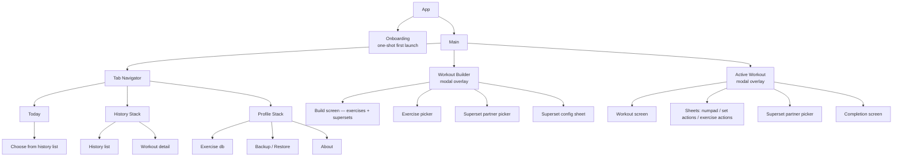
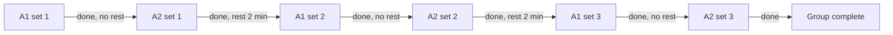
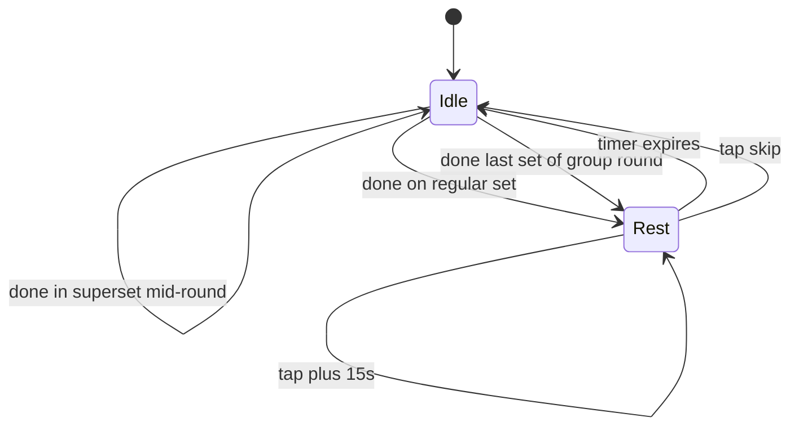
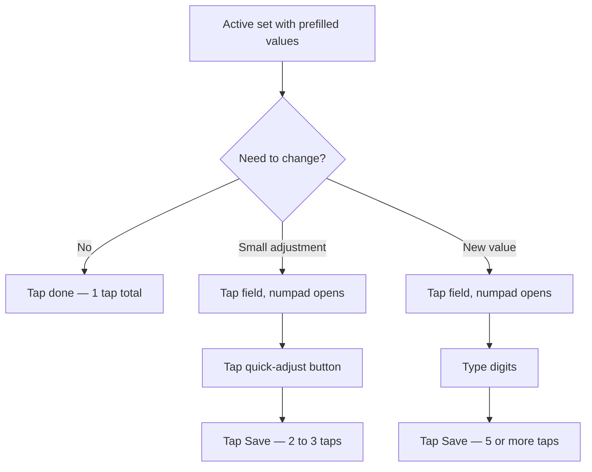
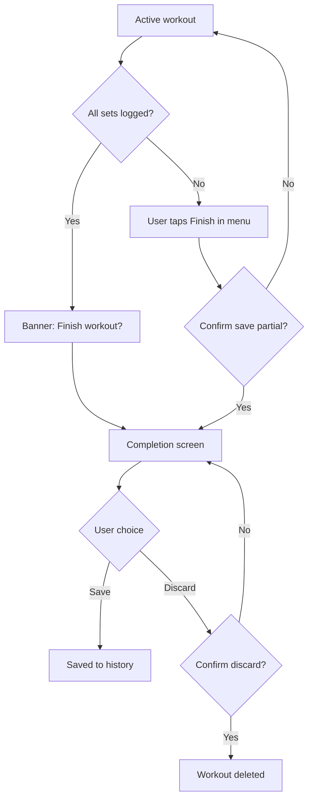

# Gym Tracker · UI/UX Specification

> Трекер тренувань у спортзалі для React Native (iOS + Android). v1 — ad-hoc workouts: побудова → виконання → логування в історію. Програми, імпорт/експорт, deep linking — у v2.

**Status**: v1 scope locked — ad-hoc workouts. Programs / import / deep linking — deferred to v2.

**Версія**: v0.7 · add Profile + Settings section

---

## 1. Базові принципи

- React Native, кросплатформенний (iOS + Android)
- Цільовий контекст — людина в спортзалі: одна рука, потіє, 5–15 секундні взаємодії між сетами, 15–30 циклів "глянув → залогував → відклав" за тренування
- Власна візуальна мова, не клонуємо Hevy / Strong / Boostcamp
- MVP-філософія: суперсети — must-have, AMRAP / drop sets / cluster — у v2
- v1 ціль: найшвидший спосіб залогувати тренування. Структура планується ad-hoc на старті або клонуванням з історії

З цього випливають базові обмеження для in-workout UI:

- Великі тач-таргети (палець, не курсор)
- Мінімум тапів на сет
- Читабельність на відстані витягнутої руки
- Очевидний "де я зараз" з одного погляду
- Темна тема обов'язкова

---

## 2. Навігація / IA

### 2.1 Top-level каркас

3 bottom tabs:

| Tab | Зміст |
|-----|-------|
| **Today** | Старт тренування: Repeat last / Choose from history / Start blank. Banner при in-progress workout-і |
| **History** | Минулі тренування хронологічно, деталь |
| **Profile** | Preferences, exercise database, backup/restore, about |

Exercise database живе всередині Profile (а не як окремий 4-й таб). Profile — generic hub для усього що не workout / history.

### 2.2 Active workout — modal full takeover

In-workout екран — modal поверх tab navigator. Tab bar ховається. Вийти можна тільки через свідому дію: `Finish` або `Discard`.

Свідома відмова від mini-bar / minimize-режиму:

- Максимальний фокус, нема відволікань
- Простіша архітектура, менше edge cases

App backgrounded → state preserved → при поверненні відкривається на тому ж місці. Старт нового workout-у при активному → prompt "Finish or discard current first".

### 2.3 Workout Builder — modal pre-workout

Pre-workout екран де юзер збирає список вправ і груп — теж modal overlay над Tab Navigator. Деталі — §4.

### 2.4 Дерево навігації



Today — single screen без stack. Workout Builder і Active Workout — modals. Решта табів мають свої стеки.

---

## 3. Pre-workout flow (Today)

### 3.1 Today — три режими

Today має три можливі стани:

**(a) Has history, no in-progress workout** — основний flow. Картка "Repeat last" + посилання `Choose from history` і `Start blank`.

**(b) No history (first launch)** — empty state. Один CTA "Start your first workout".

**(c) In-progress workout exists** — banner зверху "In-progress · Resume / Discard" + основний flow під ним.

#### 3.1.a Has history

```
┌─────────────────────────┐
│ Today              ⋯    │
├─────────────────────────┤
│                         │
│  ┌───────────────────┐  │
│  │ Last workout      │  │
│  │ Push Day · 5d ago │  │
│  │                   │  │
│  │ Bench, Pull-ups,  │  │
│  │ Push-ups, Squat   │  │
│  │                   │  │
│  │ [ Repeat last ]   │  │
│  └───────────────────┘  │
│                         │
│  Or                     │
│  > Choose from history  │
│  > Start blank workout  │
│                         │
└─────────────────────────┘
```

- **Repeat last** card показує summary останнього завершеного тренування: назва, відносна дата (`5d ago`, `2 weeks ago`), one-liner списку вправ.
- **Choose from history** — тап → list з усіма завершеними тренуваннями (chronological). Тап на тренування → клонується. Корисно для split routines (PPL, upper/lower) — юзер обирає "last upper day".
- **Start blank workout** — тап → Workout Builder з пустим списком + Quick-add chips.

#### 3.1.b No history (first launch)

```
┌─────────────────────────┐
│ Today              ⋯    │
├─────────────────────────┤
│                         │
│         💪              │
│                         │
│  Start your first       │
│  workout                │
│                         │
│  Build it from scratch  │
│  or pick from suggested │
│  exercises              │
│                         │
│  [ Start workout ]      │
│                         │
└─────────────────────────┘
```

CTA → Workout Builder з пустим списком. Quick-add chips (§4.2) видимі зверху — юзер бачить 7 знайомих вправ і починає одним тапом.

#### 3.1.c In-progress workout

Banner над основним вмістом (накладається поверх режиму (a) або (b)):

```
┌─────────────────────────┐
│ Today              ⋯    │
├─────────────────────────┤
│  ┌───────────────────┐  │
│  │ In-progress       │  │
│  │ Push Day          │  │
│  │ Resume · Discard  │  │
│  └───────────────────┘  │
│                         │
│  ... основний flow ...  │
└─────────────────────────┘
```

- Resume → Active workout modal відкривається на збереженому state
- Discard → workout прибирається з confirmation

Свідомо НЕ auto-resume: ризик попасти в забуте старе тренування одразу при відкритті.

### 3.2 Repeat last — клонування

Тап на "Repeat last" виконує:

1. Створює новий workout з ID (UUID v4) і поточною датою-часом
2. Копіює `name` з джерела
3. Копіює структуру: вправи в тому ж порядку, групи з тими ж rounds + rest, set count і таргети (reps + RPE)
4. **НЕ копіює залоговані значення** (kg, фактичні reps). Поля порожні
5. Прив'язує `prev` для кожного сета — значення з джерела клонування
6. Відкриває Workout Builder з заповненим списком — юзер може коригувати перш ніж стартувати

Юзер бачить готовий workout, може щось додати/прибрати/відредагувати, і стартує.

### 3.3 Choose from history

Окремий screen зі списком завершених тренувань (хронологічно). Те саме рендеринг що History list (§10.2). Тап на тренування → клонується (як §3.2) → відкривається Workout Builder.

`prev`-значення в клонованому workout-і беруться з обраного джерела, а не з найостаннього такого ж workout-у. Свідомо — юзер обрав цей конкретний день як точку відліку.

### 3.4 Start blank — Workout Builder

Тап → Workout Builder з пустим списком. Quick-add chips видимі зверху для швидкого старту. Можна також через "+ Add exercise" викликати full exercise picker.

Деталі builder-а — у §4.

### 3.5 Onboarding

Перший запуск:

1. App launches
2. Today screen → empty state (3.1.b)
3. Тап "Start workout" → Workout Builder з chips

Без welcome screens, без feature tour, без вибору мови (auto-detect з locale), без вибору юнітів (kg в MVP). Onboarding — функціональний, не маркетинговий.

### 3.6 Top-bar `⋯` меню Today

- Exercise database → Profile/Exercise db
- Settings → Profile (root)

---

## 4. Workout Builder

> Pre-workout екран де юзер збирає список вправ перед стартом тренування. Точки входу: Start blank (§3.4), Repeat last (§3.2), Choose from history (§3.3).

### 4.1 Структура екрана

```
┌─────────────────────────┐
│ ← Build workout         │  modal header
├─────────────────────────┤
│  Workout name           │  editable text
│  Push Day               │
├─────────────────────────┤
│                         │
│  Quick add:             │
│  [Squat][Bench][Dead]   │  chips (popular exercises)
│  [Row][OHP][Pull-up]    │
│  [Curl]                 │
│                         │
│  ─ Exercises ──────     │
│                         │
│  Bench press        ⋮   │
│   4 × 8 · RPE 7-8       │
│                         │
│  ┌── A · Superset ──┐   │  group block
│  │ 3 rounds · 2:00  │   │
│  │ A1 Pull-ups   ⋮  │   │
│  │  [6-10]          │   │
│  │ A2 Push-ups   ⋮  │   │
│  │  [10-15]         │   │
│  └─────────────── ⋮ ┘   │  group menu
│                         │
│  + Add exercise         │
│                         │
├─────────────────────────┤
│  [   Start workout   ]  │  sticky bottom
└─────────────────────────┘
```

- **Header**: back button, screen title `Build workout`. Свайп вниз закриває (з confirmation якщо щось змінено).
- **Workout name**: editable inline. При Repeat last / Choose from history заповнено з джерела. При Start blank — auto `Workout · 2026-05-02`, юзер може переписати.
- **Quick add chips**: 7 popular exercises (§4.2). Тап додає вправу з default-сетами.
- **Exercises list**: вправи + групи в порядку виконання. Кожна вправа — секція з one-liner summary і `⋮`-меню.
- **+ Add exercise**: відкриває exercise picker (повний список + пошук + custom).
- **Start workout** sticky button: запускає Active Workout modal. Disabled поки список порожній.

### 4.2 Quick-add chips

Зашитий у v1 список з 7 вправ (powerlifting + базовий комплекс):

| EN | UK |
|---|---|
| Squat | Присідання |
| Bench Press | Жим лежачи |
| Deadlift | Станова тяга |
| Barbell Row | Тяга штанги в нахилі |
| Overhead Press | Жим стоячи |
| Pull-up | Підтягування |
| Bicep Curl | Згинання на біцепс |

- Чіпи видимі завжди (постійний UX, не онбординг)
- Локалізовані з системного exercise database через `exerciseId`
- Тап → додає вправу з default-сетами в кінець списку
- Без локального ranking-у в v1 (можливе майбутнє покращення — зараз чіпи статичні)

### 4.3 Default sets для нової вправи

Коли вправа додається через Quick-add або через picker — автоматично створюється 3 сети з `reps: 8`, без RPE, без warmup. Юзер може коригувати в `⋮`-меню вправи.

Bodyweight вправи (з системної db `isBodyweight: true`) додаються без kg-поля.

### 4.4 Меню вправи `⋮` (у Builder)

| Action | Result |
|---|---|
| Edit sets | Sheet з list-ом сетів. Кожен сет — `reps` (single або range) + опц. `rpe` + warmup toggle + delete. + Add set |
| Add to superset | Multi-select picker з інших standalone-вправ → config sheet (rounds, rest) → створює групу. §6 |
| Move up / Move down | Перемістити в списку |
| Remove exercise | Видалити вправу з confirmation |
| Add note | Per-exercise note — author hint що показується в Active workout |

### 4.5 Меню групи `⋮` (у Builder)

| Action | Result |
|---|---|
| Edit rounds / rest | Sheet з rounds (2-10) і restBetweenRounds |
| Add exercise to group | Picker → додає до групи (до ліміту 5) |
| Remove exercise from group | З confirmation. Якщо лишається 1 — auto-ungroup |
| Reorder inside | Drag handles в межах групи |
| Move group up / down | Як одне ціле |
| Ungroup | Розпадається на флет-вправи в тому ж порядку |

### 4.6 Reorder зовнішнього списку

Drag handle на правому краю кожної секції (вправи або групи). Drag перемикає порядок. Групи рухаються цілком.

### 4.7 Empty list

Якщо список порожній:

```
  No exercises yet
  Tap a chip above or "+ Add exercise"
```

Start workout button disabled.

### 4.8 Discard / save для пізніше

- Закрити builder без старту → confirmation "Discard workout setup?". Підтвердити — все втрачається.
- "Save as draft" свідомо не робимо в v1: додає state-management без чіткої цінності. Юзер з готовим планом стартує одразу.

---

## 5. Архітектура in-workout екрана

### 5.1 Три зони

| Зона | Поведінка |
|---|---|
| Top bar | Фіксований. Назва тренування, прогрес `3 of 5`, час сесії, close + меню |
| Scroll list | Список вправ і груп. Скролиться вертикально. Активна позиція auto-scroll-иться у видиму зону |
| Bottom bar | Фіксований. Два режими: `idle` (порожній) або `rest` (countdown з контекстом) |

### 5.2 Картка вправи

Кожна вправа в списку — це секція з:

- Назва вправи + іконки `note` і `⋯` (per-exercise actions)
- Таблиця сетів з колонками `№ | prev | kg | reps | ✓`
- Кнопка `+ add set`

Колонки таблиці:

| Колонка | Призначення |
|---|---|
| `№` | Номер сета. Тапабельний — відкриває set actions sheet |
| `prev` | Результат цього сета з минулого тренування (з джерела клонування або з найостаннього виконання цього сета взагалі). Не таргет, бенчмарк "що побити". Формат `60×5` |
| `kg` | Поточна вага. Якщо в Builder-і / клоні задано таргет — показується ghost-text-ом. Інакше прочерк |
| `reps` | Повтори. Аналогічно до kg |
| `✓` | Чекбокс закриття сета. Тап = save + advance cursor + start rest timer |

### 5.3 Стани сета

| Стан | Візуальне представлення |
|---|---|
| Completed | Muted text + green ✓ |
| Active | Info bg highlight + bold номер + editable kg/reps |
| Next (cued) | Тонка info-кольорова бічна планка + info-tinted номер |
| Pending | Звичайний muted text |

### 5.4 Завершені вправи

Завершена вправа схлопується до однорядкового підсумку (`Bench press · 3 sets done` + green ✓). Не зникає, можна розгорнути назад тапом.

### 5.5 Editing мід-tworkout

Active workout — це повний editor поверх початкової структури.

| Action | Тригер | Поведінка |
|---|---|---|
| Add set | Кнопка `+ add set` в кінці таблиці сетів вправи | Новий пендінг сет з тими ж target-ами що останній |
| Remove set | Set actions sheet → Delete | З confirmation |
| Add exercise (в кінець) | Top bar `⋯` → Add exercise → picker | Default 3×8 сети |
| Insert exercise after current | Per-exercise `⋯` → Insert after | Додається після поточної вправи |
| Remove exercise | Per-exercise `⋯` → Remove | З confirmation. Якщо вправа має залоговані сети — попередження |
| Skip exercise | Per-exercise `⋯` → Skip | Soft-варіант: вправа лишається в структурі, помічена `Skipped` |
| Reorder | Drag handle на правому краю секції | Cursor лишається на тому ж сеті який був активним |
| Add to superset | Per-exercise `⋯` → Add to superset | §6 (з constraint: 0 залогованих сетів у кандидатах) |
| Edit superset | Group `⋯` | §6.7 |
| Ungroup | Group `⋯` → Ungroup | Завжди дозволено. §6.7 |

**Replace exercise** свідомо відкладено в v2 (в v1 вирішується через Remove + Insert after).

### 5.6 Skip exercise

Per-exercise `⋯` → Skip → exercise помічена `Skipped`, без видалення з структури:

- Залоговані сети (якщо були) лишаються у вправі
- Незалоговані сети не йдуть в volume і PR
- Cursor пропускає вправу
- У History зберігається з тими сетами що залогували (Skipped marker не потрапляє в History — там просто факт, скільки сетів зробив)
- Корисно якщо юзер хоче зберегти вправу в структурі для майбутнього clone

Для повного видалення — Remove (різниця: Skip зберігає вправу, Remove забирає з структури).

### 5.7 Failed reps (нуль повторів)

Якщо юзер не зміг зробити жодного повторення:

- `reps: 0` дозволено в numpad-і
- Сет вважається завершеним (`✓` загорається)
- У volume не йде (0 × вага = 0)
- У PR detection не входить
- У History показується як `0 reps` явно

Альтернатива "пропустити сет без логування" — set actions → Delete.

### 5.8 Auto-scroll override

Coли юзер свідомо скролить до іншої вправи (manual scroll), auto-scroll-логіка призупиняється для поточної сесії. Закриття сета все одно робить save + cursor advance, але viewport не стрибає назад до cursor-а. Юзер може прокрутити до cursor-а manually або потягнути pull-to-cursor (свайп вниз з топу).

UX pull-to-cursor — TBD до моменту реалізації, базова логіка зафіксована.

---

## 6. Суперсети / групи вправ

### 6.1 Зафіксовано в MVP

- Тільки **alternating** режим (не AMRAP, не time-based)
- Усі вправи групи мають однакову кількість раундів — уневен заборонено
- 2–5 вправ на групу
- 2-10 раундів на групу
- Один rest-таймер на групу: `restBetweenRounds`
- Без rest всередині раунду — курсор стрибає миттєво з A1 на A2
- Можна створювати pre-workout (у Builder) і мід-tworkout (у Active workout)
- **Constraint мід-tworkout**: усі кандидати-вправи мають 0 залогованих сетів

### 6.2 Створення групи

Однаковий flow на pre і mid:

1. Per-exercise `⋮`-меню → "Add to superset"
2. Якщо вправа вже в групі — додає партнера до неї (skip step 3)
3. Якщо вправа standalone — відкривається multi-select picker з інших standalone-вправ списку (де applicable: 0 залогованих сетів якщо мід-tworkout). Юзер обирає 1+ партнерів
4. Bottom sheet — config: rounds (default 3), restBetweenRounds (default 2:00). Confirm
5. Група створюється на місці першої з вправ-учасниць (по позиції в списку)

UI picker партнерів:

```
┌─────────────────────────┐
│ ← Group with        [×] │
├─────────────────────────┤
│  ☐ Pull-ups             │
│  ☐ Push-ups             │
│  ☑ Bicep curls          │
│  ⊘ Squat                │  disabled з reason
│    Already started      │
│  ⊘ Calf raise           │  disabled
│    In another superset  │
│                         │
│  1 selected             │
│  [    Configure    ]    │
└─────────────────────────┘
```

Disabled-вправи показуються з причиною ("Already started" якщо є залоговані сети, "In another superset" якщо вже в групі).

Config sheet:

```
┌─────────────────────────┐
│ Superset config         │
├─────────────────────────┤
│  Rounds       [ 3 ]     │
│  Rest         [2:00]    │
│                         │
│  [   Create group   ]   │
└─────────────────────────┘
```

### 6.3 Color-coded letter labels

Кожна група в межах одного workout-у отримує літеру і колір. A · колір 1, B · колір 2, C · колір 3. Якщо більше 3 груп (рідко) — кольори ротаційно повторюються, літери продовжуються.

Лейбл відображається в Builder, Active workout і History detail:

```
A · Superset · Round 2 of 3
●●○ (round indicators)
```

Вправи всередині групи мають префікс `A1 · Pull-ups`, `A2 · Push-ups`.

Колір застосовується до:
- Group header background tint
- Бічна вертикальна планка з'єднує вправи групи
- Set indicators у bottom rest bar (`A · Rest 2:00`)

Конкретні кольори — TBD з візуальним стилем.

### 6.4 Структура групи у списку

- Лейбл-заголовок: `A · Superset · round X of Y`
- Точки-індикатори раундів: `● ○ ○`
- Бічна вертикальна планка кольору групи з'єднує вправи групи
- Кожна вправа всередині групи має префікс `A1`, `A2`, `A3` біля назви

### 6.5 Cursor cycling



Курсор стрибає всередині раунду без паузи (миттєвий перехід між картками A1 → A2). Після останньої вправи раунду — стартує rest-таймер. Лічильник раундів зростає тільки коли всі вправи раунду закриті.

### 6.6 Bottom bar state machine



Лейбл rest-таймера показує контекст: `A · Rest 2:00` для груп (з letter color), `Rest 1:30` для звичайних вправ.

### 6.7 Edit мід-tworkout

Group `⋮`-меню в Active workout:

| Action | Constraint |
|---|---|
| Edit rounds | Збільшити завжди можна. Зменшити — тільки до значення ≥ current completed rounds |
| Edit rest | Без обмежень |
| Add exercise to group | Кандидат має 0 залогованих сетів. Group розмір ≤ 5 |
| Remove exercise from group | Якщо група лишається з 1 вправою — auto-ungroup. Confirmation якщо у вправи залоговані сети |
| Ungroup | Завжди дозволено. Логовані сети залишаються прив'язані до своїх вправ; round numbers стають sequential set numbers |

### 6.8 Відкладено в v2

- AMRAP / time-based циркуляри (rounds replaced by timer)
- Уневен сети в групі (різна кількість раундів для вправ)
- Drop sets, rest-pause, cluster sets
- Mid-workout grouping для вправ із залогованими сетами

---

## 7. Логування одного сета

### 7.1 Три швидкісні тіри

Реальний юзер у ~90% випадків робить те саме що минулого разу або з мінімальною корекцією. Дизайн оптимізує саме під цей сценарій.



### 7.2 Custom numpad (bottom sheet)

Чому власний, не системний: системна клавіатура займає ~50% екрана і ховає контекст вправи; немає gym-специфічних шорткатів `+2.5` / `+5`; decimal separator залежить від локалі і плутає; не оптимізована під одноруку роботу.

Зміст numpad-а:

1. Drag handle угорі — закрити свайпом вниз
2. Field tabs — `kg` і `reps` як два readout-блоки. Активне поле має info border. Тап перемикає фокус
3. Quick-adjust ряд: `−5`, `−2.5`, `+2.5`, `+5` для kg. Для reps автоматично перемикається на `−1`, `+1`, `−5`, `+5`
4. 3×4 numpad: цифри `0–9`, decimal `.`, backspace
5. Primary button `Save set` знизу — фіксований, доступний великим пальцем

### 7.3 Tap-to-edit поведінка

Коли юзер тапає поле з prefilled значенням:

- Поле НЕ очищується. Стає звичайним текстом, всі цифри select-all-нуті
- Backspace одразу очищує
- Можна одразу починати набирати — нове число замінює старе
- Юзер не втрачає референс що там було

### 7.4 Bodyweight вправи

Підтягування, віджимання тощо — kg-поле зайве або опціональне:

- На рівні вправи в db помітка `isBodyweight: true`
- Під час тренування показується тільки reps-поле
- Опціональне додаткове поле `+extra weight` для тих хто вішає блін на пояс

### 7.5 Decimal separator

- Локаль користувача визначає чи показуємо `.` чи `,` на numpad-і
- Внутрішньо завжди point
- Це треба пам'ятати в експорт-форматі

---

## 8. Меню дій з сетом

### 8.1 Тригер

- **Primary**: тап на номер сета (лівий стовпчик таблиці)
- **Secondary**: long-press на рядку
- Окрему `⋯` іконку НЕ додаємо — забере місце в щільній таблиці і нічого нового не дасть

### 8.2 Зміст MVP

| Action | Type | Notes |
|---|---|---|
| Mark as warmup | Toggle | Виключає сет з volume і PR |
| RPE | Picker 1–10 | Опціонально, ховається в settings якщо юзер не використовує |
| Add note | Text input | Системна клавіатура (рідкісна дія, economy of attention важить більше за швидкість) |
| Delete set | Destructive | З confirmation |

### 8.3 Візуальні маркери на рядку

Після конфігурації сет показує мінімальні бейджі:

- `W` біля номера сета — warmup
- `@8` — RPE
- маленька точка — note є

Без захаращення основного флоу — читається з одного погляду.

---

## 9. Завершення тренування

### 9.1 Flow



### 9.2 Зміст completion screen

- Назва тренування + дата + duration
- Stats grid (4 картки): `Volume`, `Sets`, `Duration`, `Personal records`
- PR card візуально виділена info-кольором — єдиний motivational accent на екрані
- Workout note (textarea, опціональна)
- Exercise summary (collapsible, показує per-exercise sets count і marker `◆` для PR; групи з letter labels)
- Primary button: `Save to history`
- Secondary text button: `Discard workout` (з confirmation)

### 9.3 PR detection — MVP

Якщо в певному rep-діапазоні юзер вперше підняв таку вагу — це PR. Маленький `◆` біля назви вправи в summary і на картці stats.

Повноцінна логіка (1RM estimation з формулами Epley / Brzycki, e1RM tracking) — пізніше.

### 9.4 Volume metric

`sum(weight × reps)` по робочих сетах (warmups виключаються). Не ідеальна метрика тренувального стресу, але стандартна — юзери звикли.

---

## 10. History

> Перегляд минулих тренувань. Минулі тренування — read-only факт. MVP мінімальний: список + detail без фільтрів і експорту (винесено в §14).

### 10.1 Огляд

History — окремий bottom tab (`Today · History · Profile`). Стек з двох екранів:

- *List* — хронологічна стрічка завершених тренувань
- *Detail* — read-only знімок одного тренування

Без topbar actions, без filter, без search, без export — все це переноситься в v2. Ціль MVP: бачити що я робив, у простій timeline-формі.

### 10.2 Список тренувань

- *Структура*: flat хронологічна стрічка, найновіше зверху, infinite scroll з lazy loading
- *Sticky section headers*: при скролі зверху приклеюється label поточного тижня/місяця (`This week`, `Last week`, `April`). Це візуальна пунктуація в flat list, не зміна структури
- *Topbar*: заголовок `History`, без actions, без back-кнопки (це root-екран таба)

Row (medium density), два рядки:

```
[Date · Workout name]                    [Duration]
[N sets · Volume kg]
```

- *Date format*: relative для останніх 7 днів (`Today`, `Yesterday`, `Mon`), absolute далі (`28 Apr 2026`)
- *Volume*: `sum(weight × reps)` по робочих сетах, warmups виключаються (узгоджено з §9.4)
- *Bodyweight*: вправи без weight дають 0 у внеску до volume

Tap на рядок → push detail screen.

### 10.3 Detail screen

Read-only знімок тренування. Жодних actions редагування.

*Header* (sticky):
- Back-кнопка
- Назва workout-у
- Підзаголовок: дата (повна) + duration

*Body* — full snapshot:
- Усі вправи в порядку виконання
- Для кожного сета: номер (або `W` для warmup), `weight × reps`, RPE (якщо було), маркер нотатки
- Workout note (якщо була залогована при completion)

*Суперсети* — group rendering як у in-workout, але read-only:
- Group header: letter label (`A · Superset · 3 rounds`)
- Список вправ у групі з префіксами A1/A2/A3
- Сети показуються по раундах
- Letter color консистентний з тим як був у workout-і

*Без actions*: немає edit, repeat workout from this entry, export — все в §14.

### 10.4 Empty state

Юзер ніколи не завершив тренування → центрований stack:

- Проста іконка (стиль ілюстрації — TBD з візуальним стилем)
- Title: `No workouts yet`
- Subtitle: `Complete your first workout to see it here.`

Bottom tab bar лишається. Без CTA — Today вже доступний в табах.

### 10.5 Що потрапляє в History

| Подія | Поведінка |
|---|---|
| Юзер натиснув `Save to history` на completion screen | Додається в History з тими сетами що залогував |
| Завершено з partial-completed (не всі заплановані сети) | Додається з логованими сетами, відсутні просто не показуються |
| Юзер натиснув `Discard workout` | Не зберігається в History |
| Skipped exercise мід-tworkout | Зберігається з тими сетами що залогувалися (якщо були) |

---

## 11. Exercise picker / Exercise database

> Спільний компонент: пошук, фільтри, перегляд і management вправ. Використовується у трьох контекстах і двох режимах.

### 11.1 Use cases і режими

| Контекст | Mode | Тригер |
|---|---|---|
| Workout Builder — `+ Add exercise` | Add | Юзер обирає вправу для додавання у Builder (§4) |
| Active workout — Top bar `⋯` → Add exercise | Add | Те саме мід-tworkout (§5.5) |
| Active workout — Per-exercise `⋯` → Insert after | Add | Insert після поточної вправи (§5.5) |
| Profile → Exercise database | Browse | Перегляд + edit/delete custom exercises |

Один screen-component, два режими:

- **Add mode** — modal overlay. Тап на рядку обирає вправу і повертає в caller з payload. Header: `← Add exercise` + `[×]` close
- **Browse mode** — pushed sub-screen у Profile stack (з Profile root → DATA → Exercise database). Тап на custom-рядку → detail. Тап на system-рядку — нічого. Header: `← Exercise database` (з back-кнопкою)

### 11.2 Структура екрана

```
┌─────────────────────────┐
│ ← Add exercise      [×] │  Add mode header
│ ← Exercise database     │  Browse mode header
├─────────────────────────┤
│  🔍 Search exercises    │
├─────────────────────────┤
│  All  Chest  Back  Legs │  muscle group chips
│  Biceps Triceps Sho…    │  (horizontal scroll)
│  Core                   │
├─────────────────────────┤
│                         │
│  Bench Press            │
│  Chest, Triceps         │
│                         │
│  Bicep Curl             │
│  Biceps                 │
│                         │
│  My weird squat   [Cus] │
│  Legs · Bodyweight    > │  > only Browse + custom
│                         │
│  ...                    │
│                         │
├─────────────────────────┤
│  + Create custom        │  sticky bottom (always)
└─────────────────────────┘
```

### 11.3 Search

- Case-insensitive substring match (`bench` знаходить `Bench Press`)
- Без fuzzy / Levenshtein у v1 (відкладено)
- Search працює одночасно з muscle group filter (AND-композиція)
- Empty search + selected filter → всі вправи з тим тегом
- Empty search + `All` → весь каталог
- Search reset кожен раз як відкривається picker

### 11.4 Muscle group filter

7 категорій у v1: **Chest · Back · Legs · Biceps · Triceps · Shoulders · Core**.

- Sticky `All` чіп завжди першим, selected by default
- Single-select (один активний чіп за раз)
- Системні вправи мають multi-tag (наприклад `Bench Press = Chest + Triceps`); фільтр по будь-якому тегу їх включає
- Custom вправи мають single-tag (один з 7), вибраний при створенні
- Фільтр reset кожен раз як відкривається picker

### 11.5 List item

Один рядок:

```
[Назва вправи]            [Custom?]
[muscle groups · attrs]   [> if Browse+custom]
```

- **Назва** — primary text
- **Muscle groups** — list через кому (`Chest, Triceps`)
- **Атрибути** — `Bodyweight` якщо `isBodyweight: true`
- **Custom badge** — маленький чіп `Custom` справа від назви для custom-вправ
- **Chevron `>`** — тільки в Browse mode для custom (натяк на edit/delete)

Сортування — alphabetical (case-insensitive).

### 11.6 Empty state — нема результатів

Якщо search не знаходить нічого:

```
┌─────────────────────────┐
│ ← Add exercise      [×] │
├─────────────────────────┤
│  🔍 cable woodchopper   │
├─────────────────────────┤
│                         │
│  Nothing found          │
│                         │
│  ┌───────────────────┐  │
│  │ + Create as custom│  │
│  │ "cable woodchopper"│ │
│  └───────────────────┘  │
└─────────────────────────┘
```

Inline affordance створення custom з тою самою назвою. Тап → відкриває Custom creation sheet з prefilled name (§11.7).

`+ Create custom` sticky-кнопка внизу теж лишається доступною — fallback для випадків коли юзер не ввів search.

### 11.7 Custom creation sheet

Викликається з:
- Inline `Create as custom 'X'` affordance (з prefilled name)
- Sticky `+ Create custom` button (з порожнім name)
- Profile → Exercise database → `+ Create custom` (з порожнім name)

```
┌─────────────────────────┐
│ ← New custom exercise   │
├─────────────────────────┤
│  Name                   │
│  [_______________]      │
│                         │
│  Muscle group           │
│  Chest Back [Legs] ...  │  single-select chips
│  Biceps Triceps Sho...  │
│  Core                   │
│                         │
│  Bodyweight     [⚪]    │  toggle
│                         │
│  [    Create    ]       │
└─────────────────────────┘
```

Поля:
- **Name** — required, non-empty
- **Muscle group** — required, single-select з 7 категорій
- **Bodyweight** — toggle, default off

Validation: name unique (case-insensitive). Якщо така вправа вже існує (system або non-deleted custom) — warning + Create disabled.

Create → нова custom вправа в db. Modal закривається. Якщо викликалось з Add mode — вправа автоматично селектиться і повертається в caller.

### 11.8 Custom exercise detail (Browse mode)

Тап на custom-рядку в Profile → Exercise database:

```
┌─────────────────────────┐
│ ← Custom exercise       │
├─────────────────────────┤
│  My weird squat         │
│  Legs · Bodyweight      │
│                         │
│  [ Edit ]               │  → Custom creation sheet з prefill
│                         │
│  [ Delete ]    (red)    │
└─────────────────────────┘
```

- **Edit** → Custom creation sheet (§11.7) з prefilled поточними даними. Confirm → updates entity in place — той самий ID, нова назва відображається у всіх past workouts
- **Delete** → confirmation: `"Delete 'X'? It won't appear in the picker anymore. Past workouts using it stay unchanged."` → soft delete (§11.9)

Системні вправи detail-екран не мають — у Browse mode тап на system-рядку нічого не робить.

### 11.9 Soft delete

Custom exercise delete = soft delete:

- Entity отримує `deletedAt: timestamp`
- Не відображається в picker (Add mode) і в Exercise database list (Browse mode)
- В History всі past workout-и продовжують показувати назву і атрибути як було (референс по ID)
- Юзер може створити нову custom з тою ж назвою — буде окрема сутність з новим ID (validation §11.7 враховує лише non-deleted)

Hard delete (видалити з History назавжди) у v1 не передбачено. Якщо колись треба — окрема дія у Settings (`Delete all data` у v1 не робимо, див. §12).

### 11.10 Що відкладено в v2 / пізніше

- Recency-based sort (нещодавно використовувані зверху)
- Multi-select в Add mode (додати кілька вправ одним flow)
- Equipment filter (Barbell / Dumbbell / Machine / Cable / Bodyweight / Kettlebell)
- Multi-tag для custom exercises (одна custom = кілька груп)
- Fuzzy search (Levenshtein, typo tolerance)
- Notes на custom exercise
- Per-exercise statistics (used in N workouts, last used) у detail
- Bulk import / export exercise db
- Hard delete custom з cascade видаленням з History

---

## 12. Profile + Settings

> Profile tab — generic hub для всього що не workout / history. Архітектура hybrid: settings inline на root-екрані, важкі workflows (Exercise db, Backup/Restore) як окремі sub-screens.

### 12.1 Profile root — структура

```
┌─────────────────────────┐
│ Profile                 │
├─────────────────────────┤
│  PREFERENCES            │
│  Theme        System ▾  │
│  Language     System ▾  │
│  Show RPE          [✓]  │
├─────────────────────────┤
│  WORKOUT                │
│  Rest haptic       [✓]  │
│  Rest sound        [⚪] │
├─────────────────────────┤
│  DATA                   │
│  Exercise database  >   │
│  Backup & restore   >   │
├─────────────────────────┤
│  About              >   │
└─────────────────────────┘
```

Profile root — root-екран таба, без back-кнопки. Заголовок `Profile`. Скрол.

Чотири блоки з grouped section headers:

| Секція | Зміст | Тип контролів |
|---|---|---|
| `PREFERENCES` | Theme, Language, Show RPE | Picker rows + toggle |
| `WORKOUT` | Rest haptic, Rest sound | Toggles |
| `DATA` | Exercise database, Backup & restore | Sub-screen rows |
| `About` | About | Sub-screen row (без префікса-секції) |

### 12.2 PREFERENCES

#### Theme

Tap → action sheet з трьома опціями: `System` (default), `Dark`, `Light`. Вибір застосовується миттєво. `System` означає auto-follow OS-теми.

`Dark` — основна тема (з §1: «темна тема обов'язкова»). `Light` робиться у v1 для повноти і System-режиму, але не як рекомендований use-case.

#### Language

Tap → action sheet з трьома опціями: `System` (default), `English`, `Ukrainian`. `System` auto-detect-ить з locale; якщо locale не English і не Ukrainian — fallback English. Override переписує detection без рестарту.

#### Show RPE

Toggle, default ON.

- ON: RPE picker доступний у set actions sheet (§8.2), бейдж `@8` рендериться у рядку сета
- OFF: пункт `RPE` зникає з set actions sheet, бейджі `@8` не показуються; раніше залоговані RPE-значення зберігаються в db і повертаються при ON

### 12.3 WORKOUT

Сигнали по закінченні rest-таймера.

| Toggle | Default | Поведінка коли ON |
|---|---|---|
| Rest haptic | ON | Haptic impact (medium) при досягненні 0:00 |
| Rest sound | OFF | Короткий cue-sound через системний audio channel |

Без push-нотифікацій у v1 (background → v2). Коли обидва OFF — таймер просто візуально доходить до 0:00.

### 12.4 DATA

#### Exercise database

Тап → відкриває §11 Exercise picker у Browse mode як push на Profile stack.

#### Backup & restore

Тап → окремий sub-screen. Спека — окрема зона, TBD.

### 12.5 About

Тап → push sub-screen зі статичним контентом:

- App name + version: `Kachka · 1.0.0 (build 42)` (build number з CI)
- Source code link → GitHub (open source)
- Privacy note: `Your data stays on this device. No accounts, no servers, no analytics.`

Без acknowledgements у v1 — додамо коли стек обраний і список залежностей зафіксується.

### 12.6 Свідомо НЕ робимо у v1

- **Delete all data** — рідкісний use case (юзер може перевстановити додаток). Якщо колись треба — окрема destructive-дія в DATA з double-confirm
- **Units toggle (kg/lb)** — kg only у v1, lb через user setting у v2 (з tech doc: «Юніти: kg only для MVP»)
- **Decimal separator override** — locale-driven, без user-facing toggle (§7.5)
- **Notifications** — push, scheduled reminders, rest-end banner у background → v2. У v1 тільки local haptic/sound (§12.3)

---

## 13. Глосарій

| Термін | Визначення |
|---|---|
| Set | Один підхід однієї вправи |
| Round / cycle | Один прохід через всі вправи групи |
| Superset | Група вправ що виконуються alternating |
| `prev` | Результат цього сета з попереднього виконання (з джерела клонування або з найостаннього тренування з цією вправою) |
| target | Задана ціль для сета (опціонально, з clone-джерела) |
| PR | Personal record, максимальна вага в певному rep-діапазоні |
| RPE | Rate of perceived exertion, 1–10, суб'єктивна важкість |
| RIR | Reps in reserve, скільки ще повторів міг зробити (інверсія RPE) |
| Volume | `weight × reps` сума, метрика об'єму тренування |
| Bodyweight | Вправа де власна вага достатня (підтягування, віджимання) |
| Workout | Одна тренувальна сесія: список вправ і груп виконаний послідовно |
| Workout Builder | Pre-workout екран де юзер збирає список перед стартом |
| Quick-add chips | Швидкі кнопки додавання популярних вправ у Builder |
| Repeat last | Клонування найостаннього завершеного workout-у |
| Choose from history | Список з усіма завершеними workout-ами для клонування |
| Letter label | Літера + колір для розрізнення кількох супер-сетів в одному workout-і (A, B, C) |
| Exercise picker | Спільний компонент пошуку/вибору вправ. Add mode у Builder/Active, Browse mode у Profile (§11) |
| System exercise | Вправа з seeded каталогу. Multi-tag по muscle groups, read-only |
| Custom exercise | Юзером створена вправа. Single-tag, edit/soft-delete доступні |
| Soft delete | Видалення через `deletedAt` flag без cascade — entity лишається у past workouts |

---

## 14. Що ще не вирішено

- **Backup / Restore UX** — окремий screen чи inline action; як виглядає експорт (share sheet?) і імпорт
- **Модель даних** — формальна схема `Workout → Group | Exercise → Set` з типами полів і правилами (TBD як окремий документ)
- **Візуальний стиль** — типографіка, кольори (включно з letter-colors для груп), density, motion, ілюстрації для empty states
- **Auto-scroll override детальна поведінка** — pull-to-cursor UI
- **Top-bar `⋯` меню pattern** — sheet (iOS-style) чи dropdown (Android)
- **Confirmation dialog generic pattern** — native alerts чи custom modal
- **Exercise database seed-список** — повний каталог системних вправ (окрім 7 chip-вправ); де брати: wger чи власний

---

## 15. Свідомо відкладено в v2 / пізніше

**Програмний шар**
- Bundled programs / custom programs / program editor
- Linear progression, pointer-based scheduling
- One active program at a time
- Програмний JSON-формат (gym-tracker-program-format.md — заморожений)

**Імпорт / шаринг**
- Import flow (file picker, conflict resolution, preview, land)
- Deep linking (gymtracker://import)
- Universal links / App Links
- Export програми / single workout (включно з Markdown для LLM-чатів)

**Тренувальні механіки**
- AMRAP та time-based циркуляри
- Drop sets, rest-pause, cluster sets
- Уневен сети в групі
- 1RM / e1RM estimation і tracking
- Replace exercise мід-tworkout (в v1 = Remove + Insert after)

**UX полегшення**
- Mid-workout grouping для вправ із залогованими сетами
- Save as draft у Workout Builder
- Mini-bar / minimize active workout
- PR badges на сетах у History detail
- History filter (period + exercise) і search
- History export (Markdown single workout / period)
- Quick-add chips ranked by usage (зараз статичні)

**Інші зони**
- Соціальні фічі (sharing, friends, feed)
- Wearable integration (Apple Watch, Wear OS)
- Voice input для логування
- Plate calculator
- Calendar-based scheduling
- Streak counters і motivational gamification
- Графіки прогресу, тенденції по вправах, PR timeline

---

## 16. Список зафіксованих рішень

**Скоуп v1**
- [x] v1 = ad-hoc workouts (build / execute / log to history)
- [x] Програми / import / deep linking → v2
- [x] 3 bottom tabs: Today · History · Profile

**Today / Pre-workout**
- [x] Three modes: has history / first launch / in-progress
- [x] Repeat last як primary CTA
- [x] Choose from history для split routines
- [x] Start blank → Workout Builder
- [x] Onboarding — straight to empty Today, без welcome screens
- [x] Crash restoration — banner на Today (Resume / Discard)

**Workout Builder**
- [x] Modal overlay над Tab Navigator
- [x] Quick-add chips: Squat, Bench Press, Deadlift, Barbell Row, Overhead Press, Pull-up, Bicep Curl
- [x] Default sets для нової вправи: 3 × 8
- [x] Editable workout name (з джерела при clone, auto-name при blank)
- [x] Reorder через drag, supersets через action menu
- [x] Start workout button disabled поки список порожній

**In-workout**
- [x] Список вправ — скрол, не карусель
- [x] Сети з опц. ціллю — ghost text (з clone-джерела)
- [x] Custom numpad замість системної клавіатури
- [x] Quick-adjust кнопки на numpad-і (`±2.5`, `±5`)
- [x] Tap на номер сета → set actions sheet
- [x] Set actions: warmup toggle, RPE 1–10, note, delete
- [x] Active workout = full editor: add/remove set, add/insert/remove exercise, reorder
- [x] Skip exercise — soft remove що зберігає структуру для clone
- [x] Failed reps (0 reps) — дозволено, save + green ✓, не йде в volume і PR
- [x] Auto-scroll призупиняється при manual scroll

**Суперсети**
- [x] Must-have в v1
- [x] Тільки alternating, 2-5 вправ, 2-10 раундів, один rest на групу
- [x] Створення pre-workout і мід-tworkout (з constraint: 0 залогованих сетів у кандидатах)
- [x] UI створення: per-exercise `⋮` → Add to superset → multi-select picker → config sheet
- [x] Color-coded letter labels (A/B/C з ротацією кольорів)
- [x] Edit rounds (constrained), rest, add/remove exercise (під те ж обмеження)
- [x] Ungroup завжди можливий, логовані сети лишаються прив'язані до своїх вправ
- [x] AMRAP / уневен / time-based — у v2

**Завершення**
- [x] Completion screen з 4 stats cards + note + summary
- [x] PR detection — простий MVP-варіант (вперше така вага в rep-діапазоні)
- [x] Volume = `sum(weight × reps)`, warmups виключені

**History**
- [x] Bottom tab `History`, root-екран без topbar actions
- [x] Flat хронологічна стрічка, найновіше зверху, infinite scroll
- [x] Sticky section headers (week / month) при скролі
- [x] Tap → detail (read-only full snapshot)
- [x] Detail body: усі вправи з усіма сетами, group rendering для суперсетів з letter labels
- [x] Volume в row — `sum(weight × reps)`, warmups виключені
- [x] Discarded workouts не зберігаються; partial-completed зберігаються
- [x] Empty state: текст + проста іконка
- [x] Filter / search / export / PR badges / графіки — у v2

**Exercise picker / Database**
- [x] Один screen-component, два режими (Add / Browse)
- [x] Search: case-insensitive substring; AND-композиція з muscle group filter
- [x] Filter: 7 muscle groups (Chest · Back · Legs · Biceps · Triceps · Shoulders · Core), single-select, sticky `All` first
- [x] System exercises — multi-tag, read-only, без detail screen
- [x] Custom exercises — single-tag, edit (entity-level rename) + soft delete
- [x] Custom creation: inline `Create as 'X'` (no-results affordance) + sticky `+ Create custom` button
- [x] Custom fields: name + muscle group + isBodyweight (notes/equipment → v1.x)
- [x] Sort alphabetical, search/filter reset на open
- [x] Single-select у Add mode (multi-select → v1.x)
- [x] Soft delete зберігає past workouts (entity by ID)

**Profile + Settings**
- [x] Profile root = hybrid hub: inline preferences + grouped sections (PREFERENCES / WORKOUT / DATA / About)
- [x] Theme: `System` / `Dark` / `Light`, default `System` (action sheet)
- [x] Language: `System` / `English` / `Ukrainian`, default `System` (auto-detect locale, fallback English)
- [x] Show RPE: toggle, default ON. OFF ховає picker з §8.2 і бейджі `@8`, не видаляє залогованих RPE-значень
- [x] Rest haptic: toggle, default ON
- [x] Rest sound: toggle, default OFF
- [x] Без push-нотифікацій у v1 (background → v2)
- [x] Exercise database, Backup & restore — окремі sub-screens
- [x] About: app version + GitHub link + privacy note (без acknowledgements у v1)
- [x] Без `Delete all data` у v1 (юзер перевстановлює додаток)
