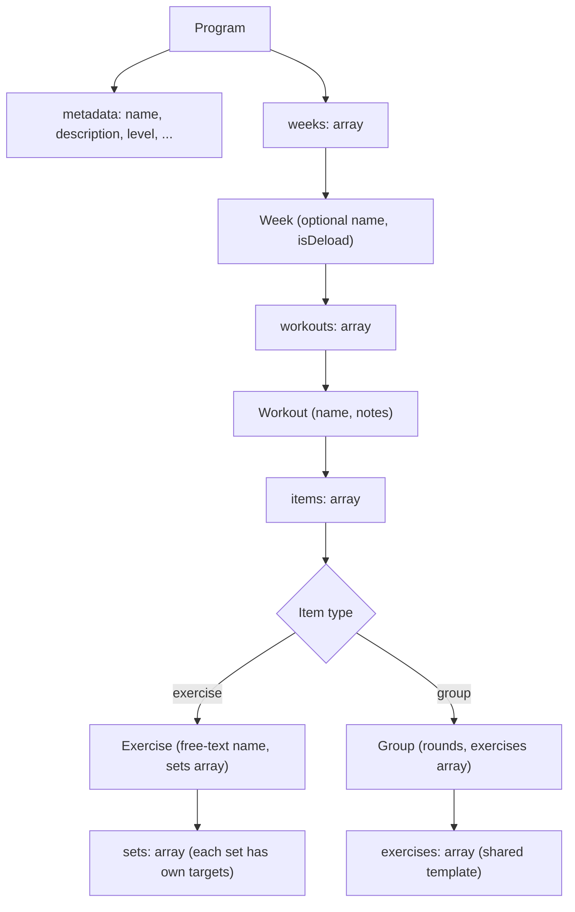
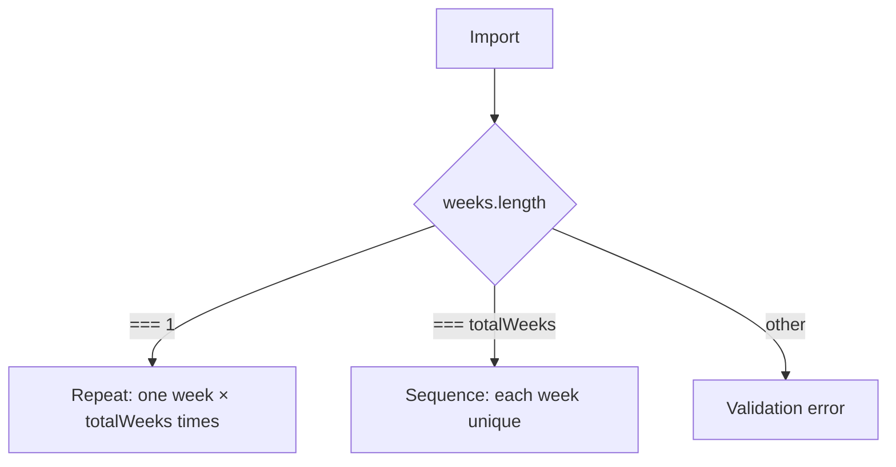
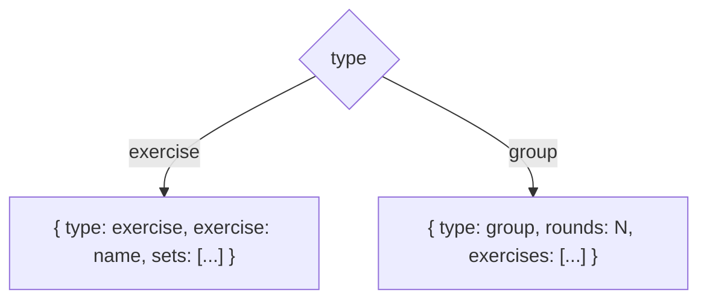
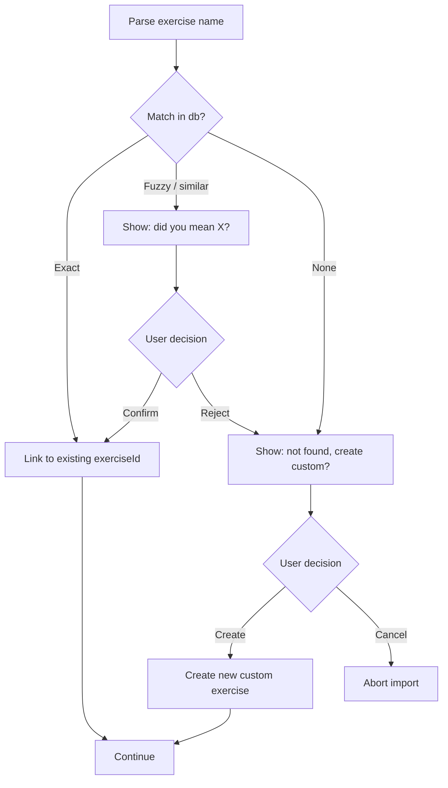

# Gym Tracker · Program Format

> ⚠️ **Status: Frozen — deferred to v2.** The program layer is fully removed from v1. The v1 app works with ad-hoc workouts (see `spec/README.md`), without the notion of a "program". This document is kept as a reference for a future v2 — the format is already designed and does not need rethinking when programs return. The import UI is also deferred to v2.

> JSON format for importing/exporting programs. One format serves: manual import, sharing between users, backup, AI generation. Technical requirements — in `tech/README.md`.

**Status**: the format is frozen at the level of fields and rules. The import UI and conflict resolution — separate work. Implementation — v2.

**Version**: v0.1 · `schemaVersion: 1` · frozen

---

## 1. Overview

The format describes a workout program as a **tree**: program → weeks → workouts → items (exercise or group) → sets.

Core principles:

- Sets are defined **without a target weight**, only by structure (reps + optional RPE). The user picks the weight themselves during the workout
- Progression between weeks is **explicit, without formulas**. If the weeks differ, the author writes each one separately
- Exercises are defined as **free text** — the importer maps them onto the exercise database via conflict resolution
- All additional fields are **optional**. A minimal valid program contains only a name, weeks, workouts, exercises, reps
- Unknown fields are **ignored** during parsing — this allows adding new fields in future versions of the format without breaking old importers



---

## 2. Top-level structure

```json
{
  "schemaVersion": 1,
  "metadata": { ... },
  "weeks": [ ... ]
}
```

| Field | Type | Required | Description |
|------|-----|-------------|------|
| `schemaVersion` | integer | yes | Format version. Currently `1` |
| `metadata` | object | yes | Name, description, tags — see §3 |
| `weeks` | array | yes | Array of weeks — see §4 |

---

## 3. Metadata

```json
{
  "name": "PPL Beginner",
  "description": "Push/Pull/Legs split, 4 weeks, 3x/week",
  "author": "Andriy",
  "level": "beginner",
  "frequencyPerWeek": 3,
  "totalWeeks": 4,
  "tags": ["hypertrophy", "split"]
}
```

| Field | Type | Required | Description |
|------|-----|-------------|------|
| `name` | string | yes | Program name, displayed in the list |
| `description` | string | no | Short description, displayed on the preview before start |
| `author` | string | no | Author. Can be any string |
| `level` | enum | no | `"beginner"`, `"intermediate"`, `"advanced"` |
| `frequencyPerWeek` | integer | no | How many workouts per week are recommended (for filters). Must be consistent with `workouts.length` in a week |
| `totalWeeks` | integer | no | How many real weeks the program lasts. If omitted — `weeks.length` is used |
| `tags` | string[] | no | Free tags for future search: `"strength"`, `"hypertrophy"`, `"home"`, `"gym"`, etc. |

---

## 4. Weeks: pattern repeat vs sequence

The `weeks` array supports two modes, determined by its length:



**Repeat mode** — `weeks.length === 1`, the program repeats this week `totalWeeks` times. Suitable for most beginner programs (PPL, Upper/Lower) where the weeks are structurally identical.

**Sequence mode** — `weeks.length === totalWeeks`, each week is written out separately. Suitable for programs with progression (5/3/1, Smolov, programs with deload).

**Other values** — a validation error. In particular, "repeat a 2-week pattern × 6 times" is not supported — the author must expand it into all 12 weeks.

### 4.1 Structure of a single week

```json
{
  "name": "Week 3 — heavy",
  "isDeload": false,
  "workouts": [ ... ]
}
```

| Field | Type | Required | Description |
|------|-----|-------------|------|
| `name` | string | no | Week name. If omitted — `"Week N"` is used |
| `isDeload` | boolean | no | A marker that this is a deload week. Affects statistics (not counted toward PRs), the UI (shows a badge). Default `false` |
| `workouts` | array | yes | Array of workouts for this week — see §5 |

---

## 5. Workout

One workout for a day.

```json
{
  "name": "Push day",
  "notes": "Warm up 5 min on treadmill before bench",
  "items": [ ... ]
}
```

| Field | Type | Required | Description |
|------|-----|-------------|------|
| `name` | string | yes | Workout name. "Push day", "Day 1", "Heavy upper" |
| `notes` | string | no | Author note for the user, displayed before the workout starts |
| `items` | array | yes | Array of items: exercise or group — see §6 |

---

## 6. Items: exercise vs group

Each item in `items` is either a single exercise or a group of exercises (superset). Distinguished by the `type` field.



### 6.1 Exercise (single exercise)

```json
{
  "type": "exercise",
  "exercise": "Bench press",
  "notes": "Pause 1 sec at chest",
  "restBetweenSets": 180,
  "isBodyweight": false,
  "sets": [
    { "reps": 8, "rpe": 7 },
    { "reps": 8, "rpe": 7 },
    { "reps": 8, "rpe": 8 },
    { "reps": 8, "rpe": 8 }
  ]
}
```

| Field | Type | Required | Description |
|------|-----|-------------|------|
| `type` | `"exercise"` | yes | Discriminator |
| `exercise` | string | yes | Exercise name as free text. The importer maps it onto the db — see §8 |
| `notes` | string | no | Author note for this exercise |
| `restBetweenSets` | integer | no | Rest seconds. Default from settings |
| `isBodyweight` | boolean | no | If `true` — the kg field is hidden in the numpad. Default `false` |
| `sets` | array | yes | Array of sets — see §7. Each set has its own targets |

### 6.2 Group (superset)

```json
{
  "type": "group",
  "rounds": 3,
  "restBetweenRounds": 120,
  "notes": "Minimize rest between A1 and A2",
  "exercises": [
    {
      "exercise": "Pull-ups",
      "isBodyweight": true,
      "reps": 8
    },
    {
      "exercise": "Incline push-ups",
      "isBodyweight": true,
      "reps": [10, 15]
    }
  ]
}
```

| Field | Type | Required | Description |
|------|-----|-------------|------|
| `type` | `"group"` | yes | Discriminator |
| `rounds` | integer | yes | Number of rounds. 2–10 (typically 3–4) |
| `restBetweenRounds` | integer | no | Rest seconds between rounds. Default from settings |
| `notes` | string | no | Author note for the group |
| `exercises` | array | yes | 2–5 exercises in the group. Each is performed once per round |

**Group exercise** (an element of the `exercises` array in a group):

| Field | Type | Required | Description |
|------|-----|-------------|------|
| `exercise` | string | yes | Exercise name |
| `notes` | string | no | Author note for this exercise within the group |
| `isBodyweight` | boolean | no | As in a regular exercise |
| `reps` | number \| [min, max] | yes | Target reps. One template for all rounds |
| `rpe` | number 1–10 | no | Target RPE |

**Why a group has no `sets` array.** All exercises in a group have the same number of rounds (= `rounds`) — this constraint is fixed in the model. Each round is one pass through all exercises. So instead of a list of sets there is one template that repeats `rounds` times. Trying to write uneven sets is simply impossible in the format.

---

## 7. Set

One set of a single exercise.

```json
{
  "reps": 8,
  "rpe": 8,
  "isWarmup": false
}
```

| Field | Type | Required | Description |
|------|-----|-------------|------|
| `reps` | number \| [min, max] | yes | Target reps. `8` or `[8, 12]` for ranges. A range is valid when `min < max`, both `> 0` |
| `rpe` | number | no | Target RPE 1–10. Decimals allowed (`8.5`) |
| `isWarmup` | boolean | no | A marker that the set is a warmup. Excluded from volume and PR detection. Default `false` |

**Why there is no weight field.** A fixed decision: programs define structure, not weight. The user picks the weight themselves during the workout, guided by `prev` (the previous workout) and the RPE target.

**What about RIR.** Not supported. Everything is internal — RPE.

**What about tempo.** Not supported as a separate field. If the author wants it — they write it in the exercise `notes`: `"Tempo 3-1-1-0"`.

---

## 8. Conflict resolution on import

Exercises in the format are free text. On import the app maps each name onto the exercise database (system + custom).



**Exact match** — an exact name match (case-insensitive, ignore leading/trailing spaces).

**Fuzzy match** — a close name (Levenshtein distance ≤ 2 characters, or substring match). For example: `"Bench press"` ↔ `"Bench Press"`, `"Pullups"` ↔ `"Pull-ups"`. The user confirms.

**No match** — creating a custom exercise with this name is offered.

The UI of this flow — separate work, not in the format. This document describes only **what** is mapped, not **how** it is shown.

---

## 9. Validation rules

On JSON import the app checks:

| Rule | Error |
|---------|---------|
| `schemaVersion` is present and known | "Unsupported schema version" |
| `metadata.name` is non-empty | "Program must have a name" |
| `weeks.length === 1 \|\| weeks.length === totalWeeks` | "Weeks count doesn't match totalWeeks" |
| Each week has `workouts.length >= 1` | "Week must have at least one workout" |
| Each workout has `items.length >= 1` | "Workout must have at least one exercise" |
| In a group `exercises.length` between 2 and 5 | "Group must have 2 to 5 exercises" |
| In a group `rounds` between 2 and 10 | "Group must have 2 to 10 rounds" |
| Each exercise has `sets.length >= 1` (regular) or `reps` (group) | "Exercise must have at least one set" |
| `reps` is a positive number or `[min, max]` where `min < max`, both > 0 | "Invalid reps value" |
| `rpe` between 1 and 10 (inclusive) | "RPE must be between 1 and 10" |

Unknown fields are ignored (forward compatibility). Duplicates in arrays are allowed (a user may want 3 identical exercises in one day — identical warmup sets, for example).

---

## 10. Full example

A realistic PPL program, 4 weeks, the last week is a deload. Pattern: `sequence`.

```json
{
  "schemaVersion": 1,
  "metadata": {
    "name": "PPL Beginner with Deload",
    "description": "Push/Pull/Legs, 3 weeks of progression + 1 deload week",
    "author": "Andriy",
    "level": "beginner",
    "frequencyPerWeek": 3,
    "totalWeeks": 4,
    "tags": ["hypertrophy", "ppl"]
  },
  "weeks": [
    {
      "name": "Week 1",
      "workouts": [
        {
          "name": "Push day",
          "items": [
            {
              "type": "exercise",
              "exercise": "Bench press",
              "restBetweenSets": 180,
              "sets": [
                { "isWarmup": true, "reps": 10 },
                { "reps": 8, "rpe": 7 },
                { "reps": 8, "rpe": 7 },
                { "reps": 8, "rpe": 8 },
                { "reps": [6, 8], "rpe": 8.5 }
              ]
            },
            {
              "type": "group",
              "rounds": 3,
              "restBetweenRounds": 120,
              "exercises": [
                { "exercise": "Pull-ups", "isBodyweight": true, "reps": [6, 10] },
                { "exercise": "Incline push-ups", "isBodyweight": true, "reps": [10, 15] }
              ]
            }
          ]
        },
        { "name": "Pull day", "items": [ "..." ] },
        { "name": "Leg day", "items": [ "..." ] }
      ]
    },
    { "name": "Week 2", "workouts": [ "..." ] },
    { "name": "Week 3", "workouts": [ "..." ] },
    {
      "name": "Week 4 — Deload",
      "isDeload": true,
      "workouts": [ "..." ]
    }
  ]
}
```

---

## 11. What is frozen — checklist

- [x] `schemaVersion: 1` as the root
- [x] Sets without `targetWeight`, structure only
- [x] Reps — `number` or `[min, max]`
- [x] RPE only, no RIR (range 1–10, optional)
- [x] Progression via explicit weeks, without formulas
- [x] `weeklyPattern` via the array length (1 = repeat, totalWeeks = sequence)
- [x] Optional `isDeload` at the week level
- [x] Author notes at 3 levels: program, workout, exercise (no per-set)
- [x] Tempo — not in the format, only in exercise notes if needed
- [x] Substitutions — not in the format (generic Replace exercise + AI takes availableEquipment into account)
- [x] Exercises — free text with conflict resolution on import
- [x] Groups: `rounds` + a shared template, not an array of sets
- [x] Unknown fields are ignored (forward compat)

---

## 12. Open questions

The import UI, conflict resolution, validation feedback, deep link landing, multi-language programs and editing after import — were designed together with the v0.4 spec. The current spec (v0.5) does not contain these zones — the program layer is deferred to v2.

Remaining:

- **Versioning and backward compat** — how to evolve the format from v1 to v2 without breaking old exports. Simplified principle: unknown fields are ignored (forward compat). A `schemaVersion` mismatch toward newer — a dead-end on import. Details of the migration strategy — TBD when v2 appears
- **`availableEquipment` user setting** — a separate field in settings for future AI generation, needs to be fixed in `tech/README.md`
