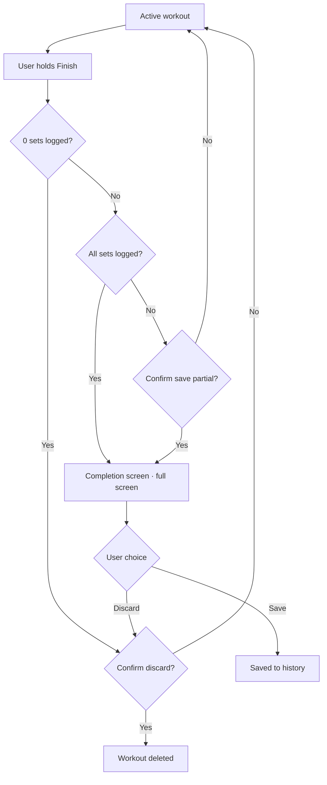

# Workout completion

> Scope: Finishing a workout — the hold-to-finish gesture, the completion screen, PR detection,
> and the volume metric. Map: docs/INDEX.md.
> Behavior only; the visual system is maintained in the Claude Design project.

## 1. Overview

The completion screen is reached from the active workout screen by holding the bottom-bar
`Finish` CTA (IN_WORKOUT.md §2.1, §2.10). §2 covers the finishing flow — the hold gesture, and
the decision points between an empty workout, a fully-logged one, and a partial one. §3 covers
the completion screen's own content. §4 covers PR detection, and §5 the volume metric shown on
its stats card.

## 2. Flow

**Finishing is a hold, not a tap.** The bottom-bar `Finish` CTA completes on a deliberate
press-and-hold (~600 ms, with a progress fill), not a single tap; it is labelled `Hold to
finish` so the gesture is discoverable, and releasing early cancels with no effect. Two reasons:
ending a session is a deliberate, once-per-workout action, and once rest ends the bottom bar
reclaims the exact slot the rest countdown's `Skip` control occupied (IN_WORKOUT.md §2.10) — a
tap landing just as rest is skipped or expires would otherwise bounce the user onto the
completion screen by accident. The hold absorbs that stray tap and any double-tap tail.
Precedent: Strava and Nike Run Club gate "end activity" the same way.

**Empty workout (0 logged sets).** If the user finishes without having logged a single set — the
completion screen is **skipped**, and a destructive confirm appears immediately: `Nothing logged
— discard this workout?` (Cancel on top, Discard at the bottom, per FOUNDATIONS.md §2). An empty
workout is not saved to History: a stats screen full of zeros is meaningless, and a junk entry
would break Repeat last (TODAY.md §3) / Choose from history (TODAY.md §4).

## 3. Completion screen content

The completion screen is **full-screen, not a bottom sheet**. Single-step: hold Finish → this
screen → Save/Discard. There is no intermediate quick-confirm sheet (deliberately: the PR card
is the app's only motivational accent, and hiding it behind a sheet while duplicating the
summary twice is not justified).

- Workout name + date + duration
- Stats grid (4 cards): `Volume`, `Sets`, `Duration`, `Personal records`
- The PR card is highlighted with the accent — the same hue used for completion/live/CTA
  elsewhere, reused here for the screen's one motivational moment; there is no separate "info"
  color in the design system
- Workout note (textarea, optional)
- Exercise summary (collapsible, shows per-exercise sets count and a `◆` marker for a PR; groups
  shown with their letter label, SUPERSETS.md §4)
- Primary button: `Save to history`
- Secondary text button: `Discard workout` (with confirmation)

## 4. PR detection — MVP

If in a given rep range the user lifts such a weight for the first time — it's a PR. A small `◆`
marks it in the exercise summary and on the stats card (§3).

## 5. Volume metric

`sum(weight × reps)` over working sets — warm-up sets are excluded (IN_WORKOUT.md §4.2). Not a
perfect metric of training stress, but a standard one — users are used to it.

## Deferred to v2

- **1RM / e1RM estimation** — full PR logic via Epley / Brzycki formulas and e1RM tracking; v1
  uses the simple first-time-at-this-rep-range MVP variant instead (§4).
