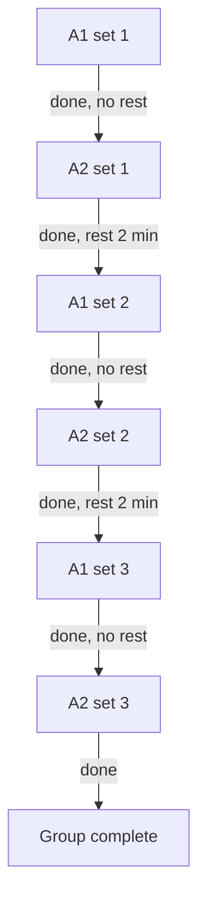
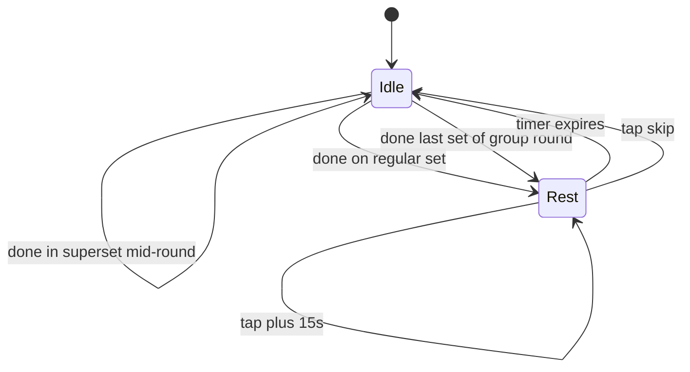

# Supersets / exercise groups

> Scope: Alternating exercise groups (supersets) — pre/mid-workout creation, letter labels,
> cursor cycling, and mid-workout editing. Map: docs/INDEX.md.
> Behavior only; the visual system is maintained in the Claude Design project.

## 1. Overview

Supersets are not a screen of their own — they are a structure that can be created and edited
from both the Workout Builder (BUILDER.md §5) and the Active workout screen (IN_WORKOUT.md
§2.5), and rendered read-only in History detail (HISTORY.md §3). §2 states what is locked for v1
— alternating-only, group size, rounds, and the constraints on mid-workout creation. §3 covers
the group-creation flow and its combined config sheet. §4 covers the letter-labeling
convention used to identify a group. §5 covers how a group renders inside the exercise list.
§6 covers cursor cycling through a group's rounds, and §7 the RestBar's idle/rest state
machine during a group. §8 covers editing a group mid-workout.

## 2. Locked for MVP

- Only **alternating** mode (not AMRAP, not time-based)
- All exercises in a group have the same number of rounds — uneven is forbidden
- 2–5 exercises per group
- 2-10 rounds per group
- One rest timer per group: `restBetweenRounds`
- No rest within a round — the cursor jumps instantly from A1 to A2
- Can be created pre-workout (in Builder) and mid-workout (in Active workout)
- **Mid-workout constraint**: all candidate exercises must have 0 logged sets

## 3. Group creation

Same flow for pre and mid:

1. Per-exercise `⋮` menu → "Add to superset"
2. If the exercise is already in a group — adds a partner to it (skip step 3)
3. If the exercise is standalone — a **single combined sheet** opens: multi-select of partners
   (other standalone exercises in the list; mid-workout — only candidates with 0 logged sets)
   together with rounds + rest on the same screen
4. The user picks 1+ partners, adjusts rounds/rest if needed (defaults: rounds 3,
   restBetweenRounds 1:30 / 90s) and taps `Create group`
5. The group is created at the position of the first participating exercise (by position in
   the list)

One combined sheet, **not a two-step** picker→config: creating a superset is a frequent action
(especially mid-workout, one hand, fatigue), defaults cover the typical path, so the user
usually just picks a partner and confirms, without touching config.

Combined sheet:

```
┌─────────────────────────┐
│ ×  Configure superset A │
│ Pick 2–5 · same rounds  │
├─────────────────────────┤
│  ☑ Pull-ups             │
│  ☑ Push-ups             │
│  ☐ Bicep curls          │
│  ⊘ Squat                │  disabled with reason
│    Already started      │
│  ⊘ Calf raise           │  disabled
│    In another superset  │
│  2 of 5 selected        │
│  ─────────────────────  │
│  Rounds       [− 3 +]   │
│  Rest   [60][90][120…]  │
│                         │
│  [   Create group   ]   │
└─────────────────────────┘
```

Disabled exercises are shown with a reason ("Already started" if there are logged sets, "In
another superset" if already in a group). `Create group` is disabled while the group has < 2
exercises.

The sheet dismisses via the leading `×` (cancel/close), swipe-down, or scrim-tap; `Create
group` (edit mode: `Save`) is the commit. There is no separate footer `Cancel` — the `×` is the
single cancel affordance, consistent with the picker. Cancelling mid-edit confirms per
FOUNDATIONS.md §2 if anything was changed.

## 4. Letter labels (no color-coding)

Each group within a single workout gets a letter only — A, B, C… continuing alphabetically as
more groups are created. **No per-group color.** The design system has exactly one accent hue,
reserved for completion/live/CTA — it doesn't support a rotating palette for group identity,
and the audited screen never needed to distinguish more than one group at a time. Groups are
told apart by letter + the framed card boundary alone.

The label is displayed in Builder, Active workout, the Completion screen (FINISH.md §3), and
History detail:

```
Superset A · Round 2 of 3
●●○ (round indicators)
```

The letter is a small inline chip on the header title (`Superset A`). Inside a **framed** group
card (Builder, Active workout, History detail) that title carries the letter, so exercises are
listed in order with **no per-row letter**; where a per-row ordinal is shown (e.g. History
detail's per-exercise set list, HISTORY.md §3) it is a plain `1`/`2` — the exercise's position in
the round. Repeating the letter on every row would be noise. The combined `A1`/`A2` ordinal
(`A1 · Pull-ups`, `A2 · Push-ups`) is the cross-reference notation for **frameless inline
references**, where no title anchors the letter — describing cursor cycling (`A1 → A2`) or
naming a set in flat prose. Compact UI labels use the short letter-prefix form instead: the
`RestBar` context line (`Superset A · Dumbbell row`), the return-to-cursor chip (`A · Set 2 ·
Dumbbell row`).

## 5. Group structure in the list

- Header label: `Superset A · round X of Y` (letter = small inline chip)
- Round indicator dots: `● ○ ○`
- The framed card boundary is what connects the group's exercises visually — no per-group
  colored connector (§4). If a vertical divider between the group's exercises is wanted later,
  it uses the same neutral hairline used throughout the UI, not a group color
- Exercises are shown in order — no per-row letter in the card (the header title carries the
  group letter). Where a per-row ordinal appears (History detail's per-exercise set list,
  HISTORY.md §3) it is a plain `1`/`2`/`3` — position in the round; the combined `A1`/`A2`/`A3`
  form stays as the cross-reference notation only for frameless inline references and compact
  labels (§4)

**Note icon.** Each child exercise inside a group carries the same note icon + inline note card
pattern as a standalone exercise row (BUILDER.md §5, IN_WORKOUT.md §2.2), scoped to that
**child exercise's own note** (the group-child's own `notes` field). Default expand state
follows the same per-screen rule as a standalone exercise row: collapsed by default in Builder,
expanded-if-filled/collapsed-if-empty in Active workout. **The group header itself (`Superset
A`) does not get its own note icon** — there is no group-level note in this UI.

## 6. Cursor cycling



The cursor jumps within a round without a pause (instant transition between cards A1 → A2).
After the last exercise of a round — the rest timer starts. The round counter increases only
when all exercises of the round are closed.

## 7. RestBar visibility state machine

`Idle` = only the persistent bottom bar is showing. `Rest` = the `RestBar` sheet is slid in
above it (IN_WORKOUT.md §2.10) — this is sheet visibility, not a bottom-bar mode.



The `RestBar` context line shows `Superset A · <current exercise>` for groups, or just the
exercise name standalone — no letter color (§4).

## 8. Edit mid-workout

Group `⋮` menu in Active workout:

| Action | Constraint |
|---|---|
| Edit rounds | Increasing is always possible. Decreasing — only down to a value ≥ current completed rounds |
| Edit rest | No restrictions |
| Add exercise to group | The candidate must have 0 logged sets. Group size ≤ 5 |
| Remove exercise from group | If the group is left with 1 exercise — auto-ungroup. Confirmation if the exercise has logged sets |
| Ungroup | Always allowed. Logged sets stay bound to their exercises; round numbers become sequential set numbers |

Besides the `⋮` menu, the group card carries a **`+ Add round`** button at its bottom — the
group-level parallel of a standalone exercise's `+ Add set`. It increments rounds by one
(adding a set to every exercise in the group at once, keeping them even), so the common "one
more round" action stays visible instead of buried in the menu. Per-exercise `Add set` does not
exist inside a group: set count is governed by rounds, and uneven sets in a group are out of
scope.

## Deferred to v2

- AMRAP / time-based circuits (rounds replaced by timer)
- Uneven sets in a group (different number of rounds for exercises)
- Drop sets, rest-pause, cluster sets
- Mid-workout grouping for exercises with logged sets
