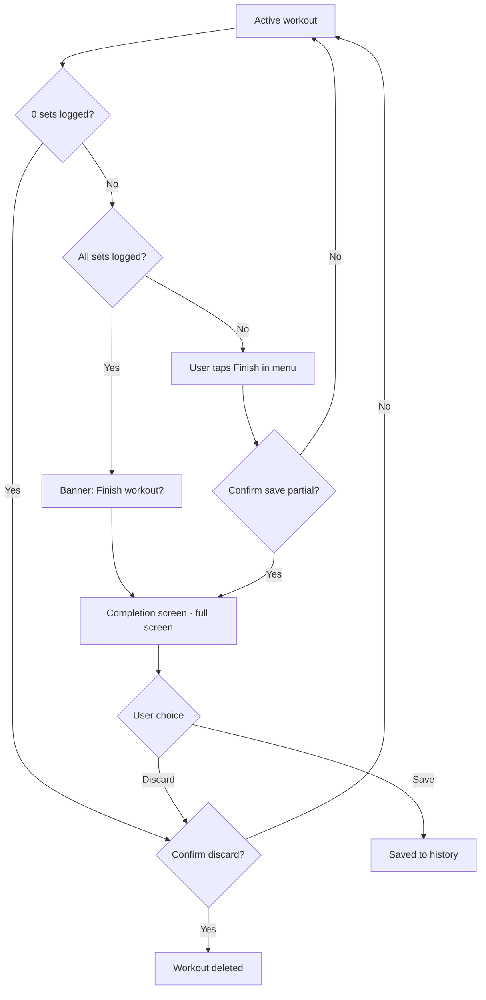

# Workout completion

> Completion screen, PR detection, volume metric (§9). Part of the Kachka v1 UI/UX spec — full map and §-index: [spec map](README.md).
> Behavior is described here; the visual system lives in `../visual/README.md`.

---

## 9. Workout completion

### 9.1 Flow

**Finishing is a hold, not a tap.** The bottom-bar `Finish` CTA (in-workout §5.10, `idle` mode) completes on a deliberate press-and-hold (~600 ms, with a progress fill), not a single tap; it is labelled `Hold to finish` so the gesture is discoverable, and releasing early cancels with no effect. Two reasons: ending a session is a deliberate, once-per-workout action, and the `idle` bar reclaims the exact slot the rest countdown's `Skip` control occupies (§5.10) — a tap landing just as rest is skipped or expires would otherwise bounce the user onto the completion screen by accident. The hold absorbs that stray tap and any double-tap tail. Precedent: Strava and Nike Run Club gate "end activity" the same way.

**Empty workout (0 logged sets).** If the user finishes without having logged a single set — the completion screen is **skipped**, and a destructive confirm appears immediately `Nothing logged — discard this workout?` (Cancel on top, Discard at the bottom, per §1). An empty workout is not saved to History: a stats screen full of zeros is meaningless, and a junk entry would break Repeat last / Choose from history.

### 9.2 Completion screen content

The completion screen is **full-screen, not a bottom sheet**. Single-step: hold Finish → this screen → Save/Discard. There is no intermediate quick-confirm sheet (deliberately: the PR card is the app's only motivational accent, and hiding it behind a sheet while duplicating the summary twice is not justified). Wireframe: `docs/wireframes/completion-screen.html` (the earlier lightweight iteration `finish-sheet.html` has been removed).

- Workout name + date + duration
- Stats grid (4 cards): `Volume`, `Sets`, `Duration`, `Personal records`
- The PR card is highlighted with the accent orange (`--accent`) — the same hue used for completion/live/CTA elsewhere, reused here for the screen's one motivational moment; there is no separate "info" color in the design system
- Workout note (textarea, optional)
- Exercise summary (collapsible, shows per-exercise sets count and a `◆` marker for a PR; groups with letter labels)
- Primary button: `Save to history`
- Secondary text button: `Discard workout` (with confirmation)

### 9.3 PR detection — MVP

If in a given rep range the user lifts such a weight for the first time — it's a PR. A small `◆` next to the exercise name in the summary and on the stats card.

Full-fledged logic (1RM estimation with Epley / Brzycki formulas, e1RM tracking) — later.

### 9.4 Volume metric

`sum(weight × reps)` over working sets (warmups excluded). Not a perfect metric of training stress, but a standard one — users are used to it.
