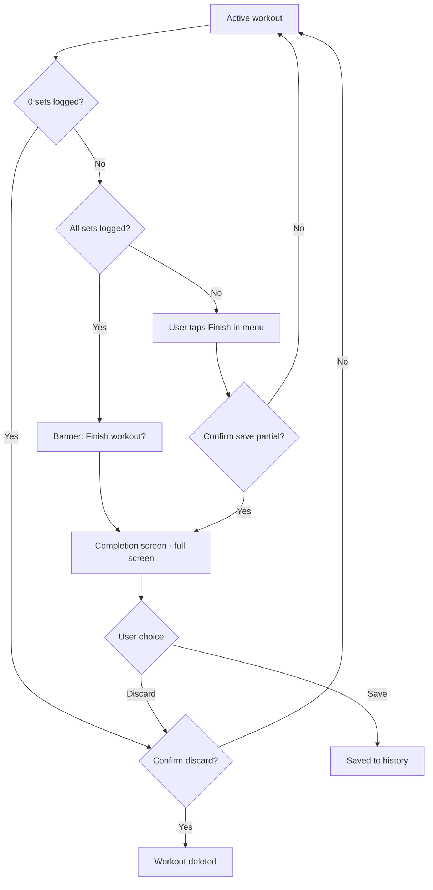

# Завершення тренування

> Completion screen, PR detection, volume metric (§9). Частина UI/UX-специфікації Kachka v1 — повна карта і §-індекс: [spec map](README.md).
> Поведінка описана тут; візуальна система — `../visual/README.md`.

---

## 9. Завершення тренування

### 9.1 Flow

**Empty workout (0 залогованих сетів).** Якщо юзер тапає Finish не залогувавши жодного сета — completion screen **пропускаємо**, одразу destructive confirm `Nothing logged — discard this workout?` (Cancel вгорі, Discard внизу, per §1). Порожній workout у History не зберігається: stats-екран з нулями безсенсовний, а junk-entry зламав би Repeat last / Choose from history.

### 9.2 Зміст completion screen

Completion screen — **повноекранний, не bottom sheet**. Одноступеневий: тап Finish → цей екран → Save/Discard. Проміжного quick-confirm sheet немає (свідомо: PR card — єдиний motivational accent застосунку, ховати його за sheet-ом і дублювати summary двічі не виправдано). Wireframe: `docs/wireframes/completion-screen.html` (попередня lightweight-ітерація `finish-sheet.html` видалена).

- Назва тренування + дата + duration
- Stats grid (4 картки): `Volume`, `Sets`, `Duration`, `Personal records`
- PR card візуально виділена info-кольором — єдиний motivational accent на екрані
- Workout note (textarea, опціональна)
- Exercise summary (collapsible, показує per-exercise sets count і marker `◆` для PR; групи з letter labels)
- Primary button: `Save to history`
- Secondary text button: `Discard workout` (з confirmation)

### 9.3 PR detection — MVP

Якщо в певному rep-діапазоні юзер вперше підняв таку вагу — це PR. Маленький `◆` біля назви вправи в summary і на картці stats.

Повноцінна логіка (1RM estimation з формулами Epley / Brzycki, e1RM tracking) — пізніше.

### 9.4 Volume metric

`sum(weight × reps)` по робочих сетах (warmups виключаються). Не ідеальна метрика тренувального стресу, але стандартна — юзери звикли.

