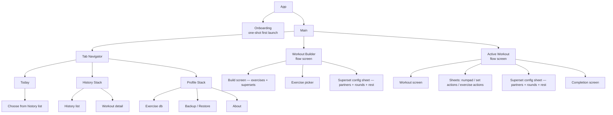

# Foundations · principles and navigation

> Base constraints of the in-workout UI (§1) and navigation / IA (§2). Part of the Kachka v1 UI/UX spec — full map and §-index: [spec map](README.md).
> Behavior is described here; the visual system lives in `../visual/README.md`.

---

## 1. Base principles

- React Native, cross-platform (iOS + Android)
- Target context — a person in the gym: one hand, sweating, 5–15 second interactions between sets, 15–30 "glance → log → defer" cycles per workout
- Own visual language, we don't clone Hevy / Strong / Boostcamp
- MVP philosophy: supersets — must-have, AMRAP / drop sets / cluster — in v2
- v1 goal: the fastest way to log a workout. Structure is planned ad-hoc at the start or by cloning from history

From this follow the base constraints for the in-workout UI:

- Large touch targets (finger, not cursor)
- Minimum taps per set
- Readability at arm's length
- Obvious "where am I now" at a glance
- Dark theme mandatory
- All action menus — bottom action sheets, the same pattern on iOS and Android. Applies to the top-bar `⋯` menu, per-row `⋮` menu (exercise, group), set actions (§8), numpad (§7.2), superset config (§6.2). Reason: thumb-reach with one hand; we avoid top-anchored dropdowns. Native action sheet (iOS) and Material Bottom Sheet (Android) — equivalent impl variants, visually unified
- All confirmations — also bottom sheet (the same component): title + opt. description + two buttons `Cancel` (top) and destructive (bottom). Swipe down = Cancel. Cancel on top — protection against accidental tap on destructive: fast dismiss without precise aim, the main action farther from the thumb. Aligned with Apple HIG (action sheet for destructive confirms) and Material 3 (modal bottom sheet). Applies to Discard workout (§3.1.c, §9.2), Discard setup (§4.8), Remove exercise / Remove set (§4.4, §4.5, §5.5), Save partial (§9.1), Delete custom (§11.8) and any future confirm flows

---

## 2. Navigation / IA

### 2.1 Top-level frame

3 bottom tabs:

| Tab | Content |
|-----|-----|
| **Today** | Start workout: Repeat last / Choose from history / Build from scratch. Banner when there is an in-progress workout |
| **History** | Past workouts chronologically, detail |
| **Profile** | Preferences, exercise database, backup/restore, about |

Exercise database lives inside Profile (not as a separate 4th tab). Profile — generic hub for everything that is not workout / history.

### 2.2 Active workout — flow screen

The In-workout screen is a full-screen step in the workout flow (Today → Builder → Active workout → Completion). It is reached by pushing forward (slide-in from the right, `←` back); the bottom tab bar is hidden — a focused path, not a tab sub-screen, but navigable back rather than a sealed modal.

`←` back returns to Today **without ending the workout**: it stays in-progress, an in-progress banner appears on Today, and the user resumes from there (§3.1.c). Ending the workout is a deliberate action: `Finish` (→ Completion → Save) or `Discard` (delete).

Only one workout is active at a time — while one is in-progress, Today shows the banner and the start CTAs are disabled until Resume or Discard (§3.1.c). App backgrounded → state preserved → on return it opens in the same place. The flow stays focused (no tab bar, no mini-player), but leaving via `←` is safe because the in-progress banner always brings the user back.

### 2.3 Workout Builder — flow screen

The pre-workout screen where the user assembles the list of exercises and groups — the first step of the workout flow (Today → Builder → Active workout). A full-screen step reached by pushing forward from Today (slide-in from the right, `←` back), with the tab bar hidden. `←` back returns to Today and discards the setup, with confirmation if anything was added (§4.8 — the Builder keeps no draft). Details — §4.

### 2.4 Navigation tree

Today — single screen without a stack. Workout Builder and Active Workout — full-screen steps of the workout flow (pushed from Today, tab bar hidden), not modals. The rest of the tabs have their own stacks.

### 2.5 Surface presentation

Every surface is one of four kinds. The kind is carried by chrome and motion — not by a single icon:

- **Tab root** — Today / History / Profile. Bottom tab bar visible.
- **Push sub-screen** — a screen within a tab's stack (History detail, Exercise database / Browse §11.1, Settings sub-screens). Slides in from the right, `←` back, swipe-from-left-edge. Full-bleed.
- **Flow screen** — a full-screen step of the workout flow (Workout Builder §2.3, Active workout §2.2). Pushed from Today, tab bar hidden, `←` back. Visually a push; set apart only by role — a forward step you progress through.
- **Sheet (modal)** — slides up from the bottom; grab handle + rounded top + scrim over the dimmed parent; dismiss on swipe-down / scrim-tap / `[×]`. Two sizes: **bottom sheet** (menus, confirmations — §1) and **page sheet** (a full-screen value-selection modal — the exercise picker in Add mode §11.1). A sheet interrupts to collect input and returns to its caller; it is neither a flow step nor a stack destination. **Sheets never physically stack**: when a menu sheet launches a form sheet (e.g. row `⋮` → `Add note` or `Add to superset`), the launching menu dismisses *first*, then the form sheet rises over the underlying screen — its scrim dims that screen, not the menu. Closing the form sheet returns to the screen, not the menu. This keeps one sheet visible at a time and renders identically on iOS and Android (no native sheet-on-sheet card stack). Visual spec: `../visual/README.md` §5.7.

The exercise picker is the canonical illustration: the same list is a **page sheet** when invoked to *add* an exercise (Add mode — pick and return) and a **push sub-screen** when reached as the Profile *Exercise database* (Browse mode — a section you navigate into). The chrome differs because the role differs; the icon (`×` vs `←`) only reinforces it.
