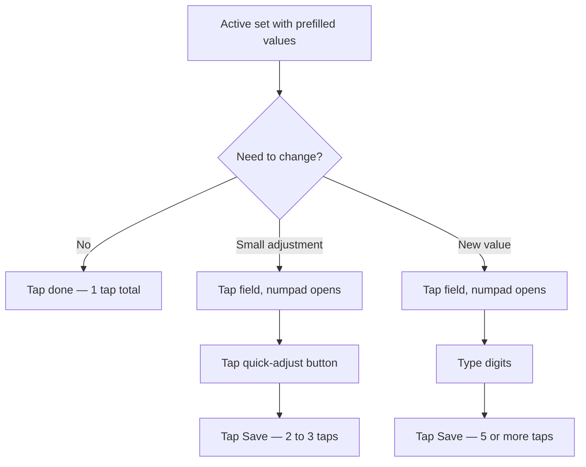

# In-workout

> Активний екран: архітектура зон (§5), логування сета + custom numpad (§7), меню дій з сетом (§8). Суперсети — окремо у `supersets.md`. Частина UI/UX-специфікації Kachka v1 — повна карта і §-індекс: [spec map](../gym-tracker-spec.md).
> Поведінка описана тут; візуальна система — `../gym-tracker-visual.md`.

---

## 5. Архітектура in-workout екрана

### 5.1 Три зони

| Зона | Поведінка |
|---|---|
| Top bar | Фіксований. Назва тренування, прогрес `3 of 5`, час сесії, close + меню |
| Scroll list | Список вправ і груп. Скролиться вертикально. Активна позиція auto-scroll-иться у видиму зону |
| Bottom bar | Фіксований. Два режими: `idle` (порожній) або `rest` (countdown з контекстом) |

### 5.2 Картка вправи

Кожна вправа в списку — це секція з:

- Назва вправи + іконки `note` і `⋯` (per-exercise actions)
- Таблиця сетів з колонками `№ | prev | kg | reps | ✓`
- Кнопка `+ add set`

Колонки таблиці:

| Колонка | Призначення |
|---|---|
| `№` | Номер сета. Тапабельний — відкриває set actions sheet |
| `prev` | Результат цього сета з минулого тренування (з джерела клонування або з найостаннього виконання цього сета взагалі). Не таргет, бенчмарк "що побити". Формат `60×5` |
| `kg` | Поточна вага. Якщо в Builder-і / клоні задано таргет — показується ghost-text-ом. Інакше прочерк |
| `reps` | Повтори. Аналогічно до kg |
| `✓` | Чекбокс закриття сета. Тап = save + advance cursor + start rest timer |

### 5.3 Стани сета

| Стан | Візуальне представлення |
|---|---|
| Completed | Muted text + green ✓ |
| Active | Info bg highlight + bold номер + editable kg/reps |
| Next (cued) | Тонка info-кольорова бічна планка + info-tinted номер |
| Pending | Звичайний muted text |

### 5.4 Завершені вправи

Завершена вправа схлопується до однорядкового підсумку (`Bench press · 3 sets done` + green ✓). Не зникає, можна розгорнути назад тапом.

### 5.5 Editing мід-tworkout

Active workout — це повний editor поверх початкової структури.

| Action | Тригер | Поведінка |
|---|---|---|
| Add set | Кнопка `+ add set` в кінці таблиці сетів вправи | Новий пендінг сет з тими ж target-ами що останній |
| Remove set | Set actions sheet → Delete | З confirmation |
| Add exercise (в кінець) | Top bar `⋯` → Add exercise → picker | Default 3×8 сети |
| Insert exercise after current | Per-exercise `⋯` → Insert after | Додається після поточної вправи |
| Remove exercise | Per-exercise `⋯` → Remove | З confirmation. Якщо вправа має залоговані сети — попередження |
| Skip exercise | Per-exercise `⋯` → Skip | Soft-варіант: вправа лишається в структурі, помічена `Skipped` |
| Reorder | Drag handle на правому краю секції | Cursor лишається на тому ж сеті який був активним |
| Add to superset | Per-exercise `⋯` → Add to superset | §6 (з constraint: 0 залогованих сетів у кандидатах) |
| Edit superset | Group `⋯` | §6.7 |
| Ungroup | Group `⋯` → Ungroup | Завжди дозволено. §6.7 |

**Replace exercise** свідомо відкладено в v2 (в v1 вирішується через Remove + Insert after).

### 5.6 Skip exercise

Per-exercise `⋯` → Skip → exercise помічена `Skipped`, без видалення з структури:

- Залоговані сети (якщо були) лишаються у вправі
- Незалоговані сети не йдуть в volume і PR
- Cursor пропускає вправу
- У History зберігається з тими сетами що залогували (Skipped marker не потрапляє в History — там просто факт, скільки сетів зробив)
- Корисно якщо юзер хоче зберегти вправу в структурі для майбутнього clone

Для повного видалення — Remove (різниця: Skip зберігає вправу, Remove забирає з структури).

### 5.7 Failed reps (нуль повторів)

Якщо юзер не зміг зробити жодного повторення:

- `reps: 0` дозволено в numpad-і
- Сет вважається завершеним (`✓` загорається)
- У volume не йде (0 × вага = 0)
- У PR detection не входить
- У History показується як `0 reps` явно

Альтернатива "пропустити сет без логування" — set actions → Delete.

### 5.8 Auto-scroll override

Коли юзер свідомо скролить до іншої вправи (manual scroll), auto-scroll-логіка призупиняється. Закриття сета все одно робить save + cursor advance логічно, але viewport не стрибає назад до cursor-а. Юзер може повернутися двома шляхами: проскролити вручну або тапнути floating "return to current set" чип.

#### Return-to-cursor chip

Floating chip над bottom bar, з'являється тільки коли активний сет повністю поза viewport (зник зверху або знизу).

```
┌─────────────────────────┐
│  ... scroll list ...    │
│                         │
│      ┌──────────────┐   │
│      │ ↑ Set 3 of 4 │   │  floating chip, info color
│      └──────────────┘   │
├─────────────────────────┤
│  A · Rest 1:23          │  bottom bar
└─────────────────────────┘
```

- *Anchor*: над bottom bar, центровано по горизонталі. Не блокує bottom bar
- *Іконка-стрілка*: `↑` якщо cursor вище viewport, `↓` якщо нижче
- *Лейбл*: коротке посилання на ціль — `Set 3 of 4` для standalone-вправи; `A · Set 3 of 4` для суперсета (літерний префікс групи)
- *Колір*: info-tint, узгоджений з cursor highlight (§5.3) — підкреслено не криклавий
- *Поведінка тапу*: smooth scroll до активного сета, chip ховається, auto-scroll знову активний
- *Visibility logic*: показ коли активний сет рендерається повністю поза viewport (з невеликим threshold-ом — 1-2 рядки за межами не вважаються "поза")
- *Не показується* коли cursor у viewport, або коли workout completed

#### Re-engage auto-scroll

Тап по chip = re-engage auto-scroll: viewport знову слідкує за cursor після advance. Якщо юзер знову свідомо скролить — auto-scroll знову призупиняється; коли cursor виходить з viewport — chip знову з'являється. Цикл повторюваний.

Свайп-down жест як альтернативу не робимо у v1: погана discoverability, верх екрану — недотяжний для thumb на 6+" телефоні, і ризик колізії з майбутнім pull-to-refresh у History. Можемо додати як power-user shortcut пізніше — окремою опцією.


---

## 7. Логування одного сета

### 7.1 Три швидкісні тіри

Реальний юзер у ~90% випадків робить те саме що минулого разу або з мінімальною корекцією. Дизайн оптимізує саме під цей сценарій.



### 7.2 Custom numpad (bottom sheet)

Чому власний, не системний: системна клавіатура займає ~50% екрана і ховає контекст вправи; немає gym-специфічних шорткатів `+2.5` / `+5`; decimal separator залежить від локалі і плутає; не оптимізована під одноруку роботу.

Зміст numpad-а:

1. Drag handle угорі — закрити свайпом вниз
2. Field tabs — `kg` і `reps` як два readout-блоки. Активне поле має info border. Тап перемикає фокус
3. Quick-adjust ряд: `−5`, `−2.5`, `+2.5`, `+5` для kg. Для reps автоматично перемикається на `−1`, `+1`, `−5`, `+5`
4. 3×4 numpad: цифри `0–9`, decimal `.`, backspace
5. Primary button `Save set` знизу — фіксований, доступний великим пальцем

### 7.3 Tap-to-edit поведінка

Коли юзер тапає поле з prefilled значенням:

- Поле НЕ очищується. Стає звичайним текстом, всі цифри select-all-нуті
- Backspace одразу очищує
- Можна одразу починати набирати — нове число замінює старе
- Юзер не втрачає референс що там було

### 7.4 Bodyweight вправи

Підтягування, віджимання тощо — kg-поле зайве або опціональне:

- На рівні вправи в db помітка `isBodyweight: true`
- Під час тренування показується тільки reps-поле
- Опціональне додаткове поле `+extra weight` для тих хто вішає блін на пояс

### 7.5 Decimal separator

- Локаль користувача визначає чи показуємо `.` чи `,` на numpad-і
- Внутрішньо завжди point
- Це треба пам'ятати в експорт-форматі


---

## 8. Меню дій з сетом

### 8.1 Тригер

- **Primary**: тап на номер сета (лівий стовпчик таблиці)
- **Secondary**: long-press на рядку
- Окрему `⋯` іконку НЕ додаємо — забере місце в щільній таблиці і нічого нового не дасть

### 8.2 Зміст MVP

| Action | Type | Notes |
|---|---|---|
| Mark as warmup | Toggle | Виключає сет з volume і PR |
| RPE | Picker 1–10 | Опціонально, ховається в settings якщо юзер не використовує |
| Add note | Text input | Системна клавіатура (рідкісна дія, economy of attention важить більше за швидкість) |
| Delete set | Destructive | З confirmation |

### 8.3 Візуальні маркери на рядку

Після конфігурації сет показує мінімальні бейджі:

- `W` біля номера сета — warmup
- `@8` — RPE
- маленька точка — note є

Без захаращення основного флоу — читається з одного погляду.

