# In-workout

> Active screen: zone architecture (§5), set logging + custom numpad (§7), set actions menu (§8). Supersets — separately in `supersets.md`. Part of the Kachka v1 UI/UX spec — full map and §-index: [spec map](README.md).
> Behavior is described here; the visual system lives in `../visual/README.md`.

---

## 5. In-workout screen architecture

### 5.1 Three zones

| Zone | Behavior |
|---|---|
| Top bar | Fixed. **Identity + elapsed only**: workout name (+ edit-pencil), the session timer (elapsed), close + menu. Carries **no workout statistics** — they live in the bottom bar |
| Scroll list | List of exercises and groups. Scrolls vertically. The active position auto-scrolls into the visible zone |
| Bottom bar | Fixed, **single persistent state** — always workout stats + `Finish` (§5.10). It never changes shape or content |
| Rest overlay | A separate `RestBar` sheet that slides in **above** the bottom bar while resting, then dismisses — not a mode of the bar itself (§5.10) |

**Workout statistics live in the bottom bar, not the header.** The top bar previously also carried a meta-row (exercise progress + set count + volume); it was removed so the header stays a calm identity strip — name + elapsed timer — and the bottom bar is the one place for live workout stats: `sets done / total · volume kg`. Rationale: one home for the numbers (no duplication or drift between header and bar), a quieter header read at arm's length, and the stats sit by the thumb next to `Finish` where the user already looks when deciding to wrap up. The session timer stays in the header because it is identity-level (how long this session has run), not a per-set logging metric.

### 5.2 Exercise card

Each exercise in the list is a section with:

- Exercise name + note icon + `⋯` icon. The note icon is **always visible**, regardless of whether the exercise has a note. Tap toggles an inline note card under the name — expand/collapse. The icon is neutral by default and turns accent (orange) only while its card is **expanded** (active state); it does not indicate whether a note has text. Default state on screen entry: **expanded if the note has text, collapsed if empty**; a manual toggle does not persist — re-entering the screen re-applies this rule. The card shows the note text, or a placeholder when empty; tapping the card focuses it directly for inline editing (caret at the end of existing text) — there is no separate editor sheet. Saves on blur (autosave, no explicit `Save` button). Same field as the Builder row's note icon (`exercise.notes`, program-format §6). Workout-level author notes (program-format §139) are deferred to v2
- Set table with columns `№ | prev | pre | kg | reps | ✓`
- `+ add set` button

Table columns:

| Column | Purpose |
|---|---|
| `№` | Set number. Tappable — opens the set actions sheet |
| `prev` | Result of this set from the previous workout (from the clone source or from the most recent performance of this set at all). Not a target, a benchmark of "what to beat". Format `60×5` |
| `pre` | The planned/prescribed reps target for this set, if one was set in the Builder or clone. A dedicated column, not ghost text inside `kg` — hideable per user preference (a set with no target collapses the column). Weight has no equivalent "pre" value: only reps are prescribed ahead of time; weight is chosen live |
| `kg` | Current weight, typed live. Dash when not yet logged |
| `reps` | Reps, typed live. Dash when not yet logged |
| `✓` | Set close checkbox. Tap = save + advance cursor + start rest timer |

### 5.3 Set states

| State | Visual representation |
|---|---|
| Completed | Muted row text + filled accent (orange) ✓ marker |
| Active | Bold number + editable kg/reps + a spinning-ring animation on the marker (in the `✓` position) — no row background highlight |
| Next (cued) | Regular muted text, same as pending — no dedicated highlight; distinguished only by being the next unclosed row after the active one |
| Pending | Regular muted text |

The design system has exactly one accent hue (orange), reserved for completion/live/CTA — there is no separate "info" color for secondary emphasis. Active is marked structurally (bold + editable + marker animation), not by a background tint; cued has no visual marker of its own beyond ordinary reading order.

### 5.4 Completed exercises

A completed exercise stays expanded — its full set table remains visible (muted rows + accent ✓ per set, §5.3). It is not collapsed to a one-line summary: the logged history should be readable without an extra tap.

### 5.5 Editing mid-workout

An active workout is a full editor on top of the initial structure.

| Action | Trigger | Behavior |
|---|---|---|
| Add set | `+ add set` button at the end of the exercise's set table | New pending set with the same targets as the last one |
| Remove set | Set actions sheet → Delete | With confirmation |
| Add exercise (at the end) | Top bar `⋯` → Add exercise → picker | Added with 1 pending set (`Add set` copies prev as the list grows, §5.9) |
| Insert exercise after current | Per-exercise `⋯` → Insert after | Added after the current exercise, with 1 pending set (§5.9) |
| Remove exercise | Per-exercise `⋯` → Remove | With confirmation. If the exercise has logged sets — a warning |
| Skip exercise | Per-exercise `⋯` → Skip | Soft variant: the exercise stays in the structure, marked `Skipped` |
| Reorder | Drag handle on the right edge of the section | The cursor stays on the same set that was active |
| Add to superset | Per-exercise `⋯` → Add to superset | §6 (with constraint: 0 logged sets in candidates) |
| Edit superset | Group `⋯` | §6.7 |
| Ungroup | Group `⋯` → Ungroup | Always allowed. §6.7 |

**Replace exercise** is deliberately deferred to v2 (in v1 it is resolved via Remove + Insert after).

### 5.6 Skip exercise

Per-exercise `⋯` → Skip → exercise marked `Skipped`, without removal from the structure:

- Logged sets (if any) stay in the exercise
- Unlogged sets do not go into volume and PR
- The cursor skips the exercise
- In History it is saved with the sets that were logged (the Skipped marker does not get into History — there it is just the fact of how many sets were done)
- Useful if the user wants to keep the exercise in the structure for a future clone

For full removal — Remove (the difference: Skip keeps the exercise, Remove takes it out of the structure).

### 5.7 Failed reps (zero reps)

If the user could not do a single rep:

- `reps: 0` is allowed in the numpad
- The set is considered completed (`✓` lights up)
- It does not go into volume (0 × weight = 0)
- It does not enter PR detection
- In History it is shown as `0 reps` explicitly

The alternative "skip a set without logging" — set actions → Delete.

### 5.8 Auto-scroll override

When the user deliberately scrolls to another exercise (manual scroll), the auto-scroll logic is paused. Closing a set still does save + cursor advance logically, but the viewport does not jump back to the cursor. The user can return two ways: scroll manually or tap the floating "return to current set" chip.

#### Return-to-cursor chip

A floating chip above the bottom bar, appears only when the active set is fully outside the viewport (disappeared at the top or bottom).

```
┌─────────────────────────┐
│  ... scroll list ...    │
│                         │
│      ┌──────────────┐   │
│      │ ↑ Set 3 of 4 │   │  floating chip, neutral surface
│      └──────────────┘   │
├─────────────────────────┤
│  RESTING          01:23 │  RestBar sheet (§5.10), shown only while resting
│  Superset A · Dumbbell  │
├─────────────────────────┤
│  5 / 14   5120 kg  ⏻    │  bottom bar — always present, unchanged
└─────────────────────────┘
```

- *Anchor*: above the bottom bar, horizontally centered. Does not block the bottom bar
- *Arrow icon*: `↑` if the cursor is above the viewport, `↓` if below
- *Label*: a short reference to the target — `Set 3 of 4` for a standalone exercise; `A · Set 3 of 4` for a superset (group letter prefix)
- *Color*: neutral surface + muted text (same `--surface-2`/`--text-2` treatment as other secondary chips) — no accent hue, deliberately not loud
- *Tap behavior*: smooth scroll to the active set, the chip hides, auto-scroll active again
- *Visibility logic*: shown when the active set renders fully outside the viewport (with a small threshold — 1-2 rows beyond the edge are not considered "outside")
- *Not shown* when the cursor is in the viewport, or when the workout is completed

#### Re-engage auto-scroll

A tap on the chip = re-engage auto-scroll: the viewport follows the cursor again after advance. If the user deliberately scrolls again — auto-scroll is paused again; when the cursor leaves the viewport — the chip appears again. The cycle is repeatable.

A swipe-down gesture as an alternative we do not do in v1: poor discoverability, the top of the screen is unreachable for the thumb on a 6+" phone, and the risk of collision with a future pull-to-refresh in History. We can add it as a power-user shortcut later — as a separate option.

### 5.9 Pending (pre-start) state + soft start

In-workout is one screen with two states: a **pending (pre-start) state** and the live state. It is not a separate screen — it is a state, the way `today-in-progress.html` documents a state of Today.

**Pending (pre-start) state.** The screen lands here when opened from the Builder or a clone:

- All sets are `pending` (§5.3). Nothing is logged yet.
- The **cursor is off** — there is no active/next set highlight.
- The **rest timer and the workout-duration clock are not running.** Setup and planning time is not counted toward duration.

This serves both personas: the Planner can lay out the full scheme (sets/reps, optional weights) before lifting; the Improviser can just start logging.

**Soft start.** The workout "begins" — the cursor moves onto the first set, the rest timer becomes armable, and the duration clock starts — at the **first logged set OR an explicit `Begin` tap, whichever happens first**. The boundary is soft, not a hard gate: logging a set is itself a start.

**Sets in the pending state.**

- **Default 1 pending set** per exercise when it is added (from the Builder, a quick-add chip, or mid-workout `⋯ → Add exercise`). The set list grows from there.
- **`Add set` copies the previous set's values** (reps / weight), so growing the set list is a single tap.
- **Pre-set weights are optional.** A pending set shows the reps target + `prev` (last workout's value, §5.2) as guidance; the weight field is blank but fillable. "Weight chosen live, guided by `prev`" remains the norm — the Planner may pre-fill weights, the Improviser need not.

### 5.10 Rest timer presentation

The rest timer is a separate **`RestBar` sheet** that slides in *above* the persistent bottom bar (§5.1) — not a floating ring, and not a mode of the bar itself. The bottom bar underneath never changes: it keeps showing `sets done / total · volume kg` + `Finish` the entire time, unobscured except by the sheet sitting above it. When a set is closed and rest starts:

- The `RestBar` sheet slides in above the bottom bar: a small uppercase `RESTING` label (accent orange) with a context line beneath it — the group + current exercise for a superset (`Superset A · Dumbbell row`), or just the exercise name standalone — and a large `MM:SS` clock to the right. Below that, a thin progress bar (accent orange, 40% opacity, same convention as the segmented round-progress) spans the sheet's width and depletes as time elapses.
- Inline controls beneath: `−15s` / `Skip rest` / `+15s` — `Skip rest` is the wider, accented center button; the two adjust buttons are neutral.
- When Rest haptic is ON (§12.3) a subtle pulse sits by the label; hidden when OFF.
- When rest ends or is skipped, the `RestBar` sheet dismisses, revealing the unchanged bottom bar underneath. `Finish` still completes on a **hold**, not a tap (§9.1) — a deliberate, once-per-workout action, and a safeguard against a stray tap landing during the sheet's dismiss transition.
- **Initial duration** comes from `Default rest` in Profile (§12.3, default `90 s`). Supersets use their own per-group rest from the superset config (§6.2) instead. If `Default rest` is `Off`, closing a set does not auto-start a countdown — no `RestBar` appears.

A large floating ring was considered and rejected: it costs ~180px, pushes the set list down, and collides with the return-to-cursor chip (§5.8). The `RestBar` sheet stays glanceable without needing a separate floating ring.

**Coexistence with the return-to-cursor chip (§5.8).** The chip floats in the content area *above* the bottom bar; the `RestBar` sheet also sits above the bottom bar, higher up still. They sit on different layers and never collide — both can be visible at once (resting while scrolled away from the cursor): chip above the bar, `RestBar` sheet above that.


---

## 7. Logging a single set

### 7.1 Three speed tiers

A real user in ~90% of cases does the same thing as last time or with minimal correction. The design optimizes specifically for this scenario.

```mermaid
flowchart TD
    Start[Active set with prefilled values]
    Start --> Decide{Need to change?}
    Decide -->|No| Tap1[Tap done — 1 tap total]
    Decide -->|Small adjustment| Open1[Tap field, numpad opens]
    Open1 --> Adj[Tap quick-adjust button]
    Adj --> Save1[Tap Save — 2 to 3 taps]
    Decide -->|New value| Open2[Tap field, numpad opens]
    Open2 --> Type[Type digits]
    Type --> Save2[Tap Save — 5 or more taps]
```



### 7.2 Custom numpad (bottom sheet)

Why a custom one, not the system one: the system keyboard takes up ~50% of the screen and hides the exercise context; there are no gym-specific shortcuts `+2.5` / `+5`; the decimal separator depends on the locale and confuses; it is not optimized for one-handed work.

Contents of the numpad:

1. Drag handle at the top — close by swiping down
2. Field tabs — `kg` and `reps` as two readout blocks. The active field has an info border. A tap switches focus
3. Quick-adjust row: `−5`, `−2.5`, `+2.5`, `+5` for kg. For reps it automatically switches to `−1`, `+1`, `−5`, `+5`
4. 3×4 numpad: digits `0–9`, decimal `.`, backspace
5. Primary button `Save set` at the bottom — fixed, reachable by the thumb

### 7.3 Tap-to-edit behavior

When the user taps a field with a prefilled value:

- The field is NOT cleared. It becomes regular text, all digits select-all-ed
- Backspace immediately clears
- You can start typing right away — the new number replaces the old one
- The user does not lose the reference of what was there

### 7.4 Bodyweight exercises

Pull-ups, push-ups, etc. — the kg field is redundant or optional:

- At the exercise level in the db a `isBodyweight: true` mark
- During the workout only the reps field is shown
- An optional additional `+extra weight` field for those who hang a plate on a belt

### 7.5 Decimal separator

- The user's locale determines whether we show `.` or `,` on the numpad
- Internally always point
- This must be remembered in the export format


---

## 8. Set actions menu

### 8.1 Trigger

- **Primary**: tap on the set number (left column of the table)
- **Secondary**: long-press on the row
- We do NOT add a separate `⋯` icon — it would take space in the dense table and give nothing new

### 8.2 MVP contents

| Action | Type | Notes |
|---|---|---|
| Set type | Picker — `Working` / `Warm-up` | Warm-up excludes the set from volume and PR; switching back to `Working` restores the set's sequential number. Inline single-select segment, same tap-to-commit pattern as RPE — both states always visible, so reverting an accidental warm-up is one tap |
| RPE | Picker 1–10 | Optional, hides in settings if the user does not use it |
| Delete set | Destructive | With confirmation |

### 8.3 Visual markers on the row

After configuration the set shows minimal badges:

- `W` in place of the set number (amber) — warm-up. Working sets number 1, 2, 3…; warm-ups stay unnumbered (§8.2)
- `@8` — RPE

Without cluttering the main flow — readable at a glance.
