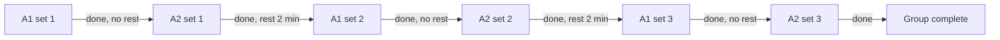
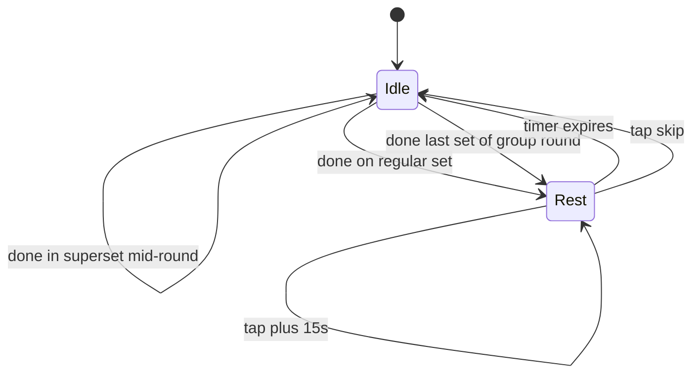

# Суперсети / групи вправ

> Alternating-групи: створення pre/mid-workout, color-coded labels, cursor cycling, edit (§6). Частина UI/UX-специфікації Kachka v1 — повна карта і §-індекс: [spec map](README.md).
> Поведінка описана тут; візуальна система — `../visual/README.md`.

---

## 6. Суперсети / групи вправ

### 6.1 Зафіксовано в MVP

- Тільки **alternating** режим (не AMRAP, не time-based)
- Усі вправи групи мають однакову кількість раундів — уневен заборонено
- 2–5 вправ на групу
- 2-10 раундів на групу
- Один rest-таймер на групу: `restBetweenRounds`
- Без rest всередині раунду — курсор стрибає миттєво з A1 на A2
- Можна створювати pre-workout (у Builder) і мід-tworkout (у Active workout)
- **Constraint мід-tworkout**: усі кандидати-вправи мають 0 залогованих сетів

### 6.2 Створення групи

Однаковий flow на pre і mid:

1. Per-exercise `⋮`-меню → "Add to superset"
2. Якщо вправа вже в групі — додає партнера до неї (skip step 3)
3. Якщо вправа standalone — відкривається **єдиний combined sheet**: multi-select партнерів (інші standalone-вправи списку; мід-tworkout — тільки кандидати з 0 залогованих сетів) разом з rounds + rest на тому ж екрані
4. Юзер обирає 1+ партнерів, за потреби коригує rounds/rest (defaults: rounds 3, restBetweenRounds 1:30 / 90s) і тапає `Create group`
5. Група створюється на місці першої з вправ-учасниць (по позиції в списку)

Один combined sheet, **не двоступеневий** picker→config: створення суперсету — часта дія (зокрема мід-tworkout, одна рука, втома), defaults покривають типовий шлях, тож юзер зазвичай просто обирає партнера і підтверджує, не торкаючись config.

Combined sheet:

```
┌─────────────────────────┐
│ Configure superset A    │
│ Pick 2–5 · same rounds  │
├─────────────────────────┤
│  ☑ Pull-ups             │
│  ☑ Push-ups             │
│  ☐ Bicep curls          │
│  ⊘ Squat                │  disabled з reason
│    Already started      │
│  ⊘ Calf raise           │  disabled
│    In another superset  │
│  2 of 5 selected        │
│  ─────────────────────  │
│  Rounds       [− 3 +]   │
│  Rest   [60][90][120…]  │
│                         │
│  [   Create group   ]   │
└─────────────────────────┘
```

Disabled-вправи показуються з причиною ("Already started" якщо є залоговані сети, "In another superset" якщо вже в групі). `Create group` disabled поки в групі < 2 вправ.

### 6.3 Color-coded letter labels

Кожна група в межах одного workout-у отримує літеру і колір. A · колір 1, B · колір 2, C · колір 3. Якщо більше 3 груп (рідко) — кольори ротаційно повторюються, літери продовжуються.

Лейбл відображається в Builder, Active workout і History detail:

```
A · Superset · Round 2 of 3
●●○ (round indicators)
```

Вправи всередині групи мають префікс `A1 · Pull-ups`, `A2 · Push-ups`.

Колір застосовується до:
- Group header background tint
- Бічна вертикальна планка з'єднує вправи групи
- Set indicators у bottom rest bar (`A · Rest 2:00`)

Конкретні кольори — TBD з візуальним стилем.

### 6.4 Структура групи у списку

- Лейбл-заголовок: `A · Superset · round X of Y`
- Точки-індикатори раундів: `● ○ ○`
- Бічна вертикальна планка кольору групи з'єднує вправи групи
- Кожна вправа всередині групи має префікс `A1`, `A2`, `A3` біля назви

### 6.5 Cursor cycling



Курсор стрибає всередині раунду без паузи (миттєвий перехід між картками A1 → A2). Після останньої вправи раунду — стартує rest-таймер. Лічильник раундів зростає тільки коли всі вправи раунду закриті.

### 6.6 Bottom bar state machine



Лейбл rest-таймера показує контекст: `A · Rest 2:00` для груп (з letter color), `Rest 1:30` для звичайних вправ.

### 6.7 Edit мід-tworkout

Group `⋮`-меню в Active workout:

| Action | Constraint |
|---|---|
| Edit rounds | Збільшити завжди можна. Зменшити — тільки до значення ≥ current completed rounds |
| Edit rest | Без обмежень |
| Add exercise to group | Кандидат має 0 залогованих сетів. Group розмір ≤ 5 |
| Remove exercise from group | Якщо група лишається з 1 вправою — auto-ungroup. Confirmation якщо у вправи залоговані сети |
| Ungroup | Завжди дозволено. Логовані сети залишаються прив'язані до своїх вправ; round numbers стають sequential set numbers |

### 6.8 Відкладено в v2

- AMRAP / time-based циркуляри (rounds replaced by timer)
- Уневен сети в групі (різна кількість раундів для вправ)
- Drop sets, rest-pause, cluster sets
- Mid-workout grouping для вправ із залогованими сетами

