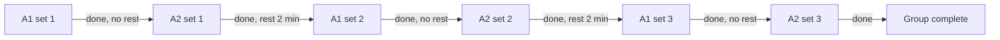
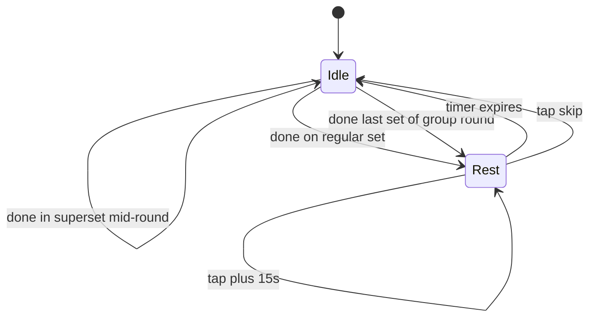

# Supersets / exercise groups

> Alternating groups: pre/mid-workout creation, color-coded labels, cursor cycling, edit (§6). Part of the Kachka v1 UI/UX spec — full map and §-index: [spec map](README.md).
> Behavior is described here; the visual system lives in `../visual/README.md`.

---

## 6. Supersets / exercise groups

### 6.1 Locked for MVP

- Only **alternating** mode (not AMRAP, not time-based)
- All exercises in a group have the same number of rounds — uneven is forbidden
- 2–5 exercises per group
- 2-10 rounds per group
- One rest timer per group: `restBetweenRounds`
- No rest within a round — the cursor jumps instantly from A1 to A2
- Can be created pre-workout (in Builder) and mid-workout (in Active workout)
- **Mid-workout constraint**: all candidate exercises must have 0 logged sets

### 6.2 Group creation

Same flow for pre and mid:

1. Per-exercise `⋮` menu → "Add to superset"
2. If the exercise is already in a group — adds a partner to it (skip step 3)
3. If the exercise is standalone — a **single combined sheet** opens: multi-select of partners (other standalone exercises in the list; mid-workout — only candidates with 0 logged sets) together with rounds + rest on the same screen
4. The user picks 1+ partners, adjusts rounds/rest if needed (defaults: rounds 3, restBetweenRounds 1:30 / 90s) and taps `Create group`
5. The group is created at the position of the first participating exercise (by position in the list)

One combined sheet, **not a two-step** picker→config: creating a superset is a frequent action (especially mid-workout, one hand, fatigue), defaults cover the typical path, so the user usually just picks a partner and confirms, without touching config.

Combined sheet:

```
┌─────────────────────────┐
│ ×  Configure superset A │
│ Pick 2–5 · same rounds  │
├─────────────────────────┤
│  ☑ Pull-ups             │
│  ☑ Push-ups             │
│  ☐ Bicep curls          │
│  ⊘ Squat                │  disabled with reason
│    Already started      │
│  ⊘ Calf raise           │  disabled
│    In another superset  │
│  2 of 5 selected        │
│  ─────────────────────  │
│  Rounds       [− 3 +]   │
│  Rest   [60][90][120…]  │
│                         │
│  [   Create group   ]   │
└─────────────────────────┘
```

Disabled exercises are shown with a reason ("Already started" if there are logged sets, "In another superset" if already in a group). `Create group` is disabled while the group has < 2 exercises.

The sheet dismisses via the leading `×` (cancel/close), swipe-down, or scrim-tap; `Create group` (edit mode: `Save`) is the commit. There is no separate footer `Cancel` — the `×` is the single cancel affordance, consistent with the picker (sheet chrome: visual §5.7). Cancelling mid-edit confirms per §1 if anything was changed.

### 6.3 Color-coded letter labels

Each group within a single workout gets a letter and a color. A · color 1, B · color 2, C · color 3. If there are more than 3 groups (rare) — colors repeat rotationally, letters continue.

The label is displayed in Builder, Active workout and History detail:

```
Superset A · Round 2 of 3
●●○ (round indicators)
```

The letter is a small inline chip on the header title (`Superset A`, visual §2.5). Inside a **framed** group card (Builder, Active workout, History detail) that title carries the letter, so exercises are listed in order with **no per-row letter**; where a per-row ordinal is shown (e.g. History detail's round-by-round, §10.3) it is a plain `1`/`2` — the exercise's position in the round. Repeating the letter on every row would be noise. The combined `A1`/`A2` ordinal (`A1 · Pull-ups`, `A2 · Push-ups`) is the cross-reference notation for **frameless inline references**, where no title anchors the letter — describing cursor cycling (`A1 → A2`) or naming a set in flat prose. Compact UI labels use the short letter-prefix form instead: the rest bar `A · Rest`, the return-to-cursor chip `A · Set 2 · Dumbbell row`.

The color is applied to:
- Group header background tint
- Side vertical bar connecting the group's exercises
- Set indicators in the bottom rest bar (`A · Rest 2:00`)

Specific colors — TBD with the visual style.

### 6.4 Group structure in the list

- Header label: `Superset A · round X of Y` (letter = small inline chip, visual §2.5)
- Round indicator dots: `● ○ ○`
- Side vertical bar in the group's color connects the group's exercises
- Exercises are shown in order — no per-row letter in the card (the header title carries the group letter). Where a per-row ordinal appears (History detail's round-by-round, §10.3) it is a plain `1`/`2`/`3` — position in the round; the combined `A1`/`A2`/`A3` form stays as the cross-reference notation only for frameless inline references and compact labels (§6.3)

### 6.5 Cursor cycling



The cursor jumps within a round without a pause (instant transition between cards A1 → A2). After the last exercise of a round — the rest timer starts. The round counter increases only when all exercises of the round are closed.

### 6.6 Bottom bar state machine



The rest-timer label shows context: `A · Rest 2:00` for groups (with letter color), `Rest 1:30` for regular exercises.

### 6.7 Edit mid-workout

Group `⋮` menu in Active workout:

| Action | Constraint |
|---|---|
| Edit rounds | Increasing is always possible. Decreasing — only down to a value ≥ current completed rounds |
| Edit rest | No restrictions |
| Add exercise to group | The candidate must have 0 logged sets. Group size ≤ 5 |
| Remove exercise from group | If the group is left with 1 exercise — auto-ungroup. Confirmation if the exercise has logged sets |
| Ungroup | Always allowed. Logged sets stay bound to their exercises; round numbers become sequential set numbers |

Besides the `⋮` menu, the group card carries a **`+ Add round`** button at its bottom — the group-level parallel of a standalone exercise's `+ Add set`. It increments rounds by one (adding a set to every exercise in the group at once, keeping them even), so the common "one more round" action stays visible instead of buried in the menu. Per-exercise `Add set` does not exist inside a group: set count is governed by rounds, and uneven sets in a group are out of scope (§6.8).

### 6.8 Deferred to v2

- AMRAP / time-based circulars (rounds replaced by timer)
- Uneven sets in a group (different number of rounds for exercises)
- Drop sets, rest-pause, cluster sets
- Mid-workout grouping for exercises with logged sets
