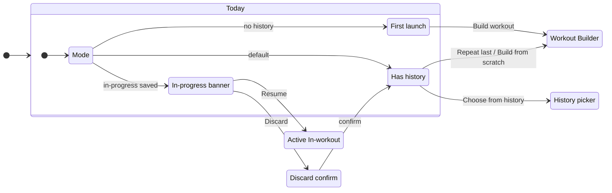
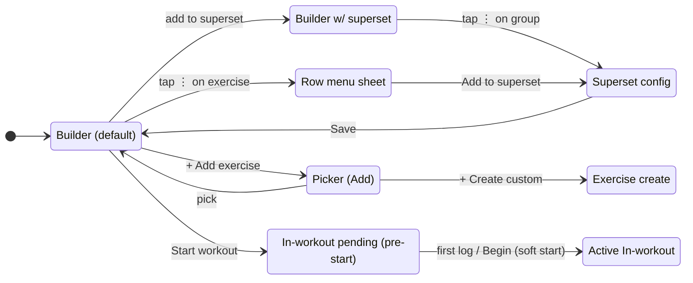
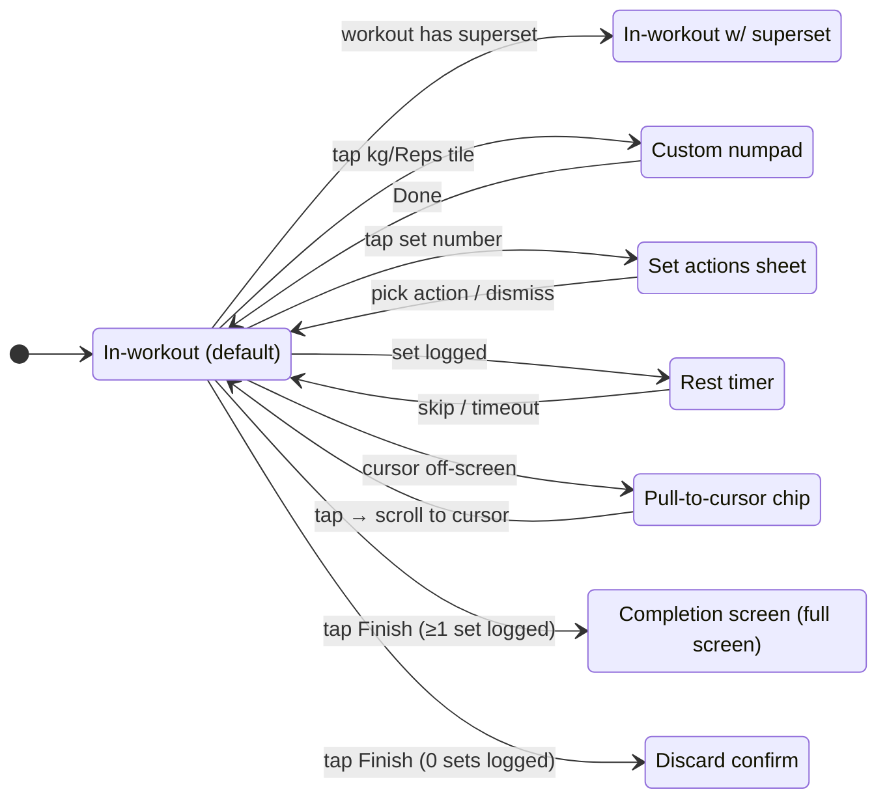
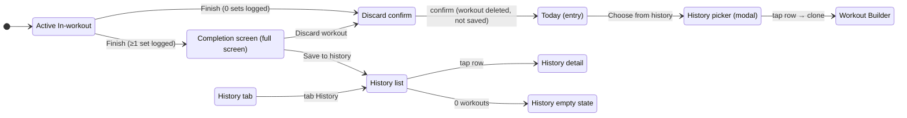
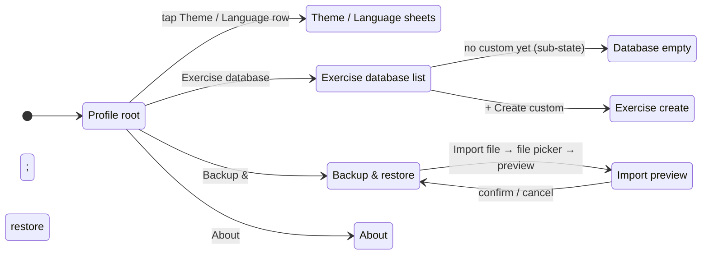

# Kachka · Flow diagram

> Високорівнева мапа усіх екранів v1 і переходів між ними. Кожна нода — окремий wireframe HTML. Кожне ребро — конкретний користувальницький екшн (тап, swipe, тощо).

Читай разом з [INDEX.md](INDEX.md) (статус мокапів) і `../spec/README.md` (поведінка).

**Status**: Усі v1 ноди тепер мають HTML-файли (drafts). Subflow діаграми — wired нижче.

---

## Top-level state diagram

```mermaid
stateDiagram-v2
    direction LR
    [*] --> AppLaunch

    AppLaunch --> TodayFirst: no history
    AppLaunch --> TodayHasHistory: has history
    AppLaunch --> TodayInProgress: in-progress workout exists

    state "Today / first launch" as TodayFirst
    state "Today / has history" as TodayHasHistory
    state "Today / in-progress banner" as TodayInProgress
    state "In-workout / pending (pre-start)" as ActiveWorkoutPending

    TodayFirst --> Builder: tap Build workout
    TodayHasHistory --> Builder: tap Repeat last (clone)
    TodayHasHistory --> HistoryPicker: tap Choose from history
    TodayHasHistory --> Builder: tap Build from scratch
    TodayInProgress --> ActiveWorkout: tap Resume
    TodayInProgress --> ConfirmDiscard: tap Discard
    ConfirmDiscard --> TodayHasHistory: confirm

    HistoryPicker --> Builder: tap workout (clone)
    Builder --> ActiveWorkoutPending: tap Start workout
    ActiveWorkoutPending --> ActiveWorkout: first set logged / tap Begin (soft start)
    Builder --> TodayHasHistory: tap back / Discard setup
    ActiveWorkout --> CompletionScreen: tap Finish (≥1 set logged)
    ActiveWorkout --> ConfirmDiscard: tap Finish (0 sets logged)
    CompletionScreen --> HistoryList: tap Save to history
    CompletionScreen --> ConfirmDiscard: tap Discard workout

    TodayHasHistory --> HistoryList: tab History
    TodayHasHistory --> Profile: tab Profile
    HistoryList --> HistoryDetail: tap row
    Profile --> ExerciseDatabase: tap Exercise database
    Profile --> BackupRestore: tap Backup &amp; restore
    Profile --> Settings: tap Settings rows

    state "Workout Builder" as Builder
    state "Exercise picker (Add mode)" as ExercisePickerAdd
    state "Exercise picker (Browse mode)" as ExercisePickerBrowse
    state "Active In-workout" as ActiveWorkout
    state "Completion screen (full screen)" as CompletionScreen
    state "History list" as HistoryList
    state "History detail" as HistoryDetail
    state "History picker" as HistoryPicker
    state "Profile root" as Profile
    state "Exercise database" as ExerciseDatabase
    state "Backup &amp; restore" as BackupRestore
    state "Settings sub-screens" as Settings
    state "Discard confirm sheet" as ConfirmDiscard

    Builder --> ExercisePickerAdd: tap + Add exercise
    ActiveWorkout --> ExercisePickerAdd: tap + Add exercise
    ExercisePickerAdd --> Builder: pick exercise
    ExercisePickerAdd --> ActiveWorkout: pick exercise (mid-workout)
    Profile --> ExercisePickerBrowse: tap Exercise database
    ExercisePickerBrowse --> ExerciseCreate: tap Create custom
    state "Exercise create" as ExerciseCreate

    ActiveWorkout --> Numpad: tap kg/Reps tile
    Numpad --> ActiveWorkout: dismiss
    ActiveWorkout --> SetActionsSheet: tap set number
    SetActionsSheet --> ActiveWorkout: dismiss / pick action
    ActiveWorkout --> SupersetConfig: tap ⋮ → Add to superset
    Builder --> SupersetConfig: tap ⋮ → Add to superset
    SupersetConfig --> Builder: confirm
    SupersetConfig --> ActiveWorkout: confirm

    state "Custom numpad" as Numpad
    state "Set actions sheet" as SetActionsSheet
    state "Superset config sheet" as SupersetConfig
```

---

## Subflows

### Today flow (Batch 1, ✅ wired)

Файли: [today-has-history.html](today-has-history.html) · [today-first.html](today-first.html) · [today-in-progress.html](today-in-progress.html)

---

### Builder + Picker + Superset (Batch 2, ✅ wired)

Файли: [builder.html](builder.html) · [builder-with-supersets.html](builder-with-supersets.html) · [exercise-picker-add.html](exercise-picker-add.html) · [superset-config-sheet.html](superset-config-sheet.html) · [builder-row-menu-sheet.html](builder-row-menu-sheet.html) · [exercise-create.html](exercise-create.html)

---

### In-workout family (Batch 3, ✅ wired)

Файли: [in-workout.html](in-workout.html) · [in-workout-pending.html](in-workout-pending.html) · [in-workout-with-supersets.html](in-workout-with-supersets.html) · [numpad.html](numpad.html) · [set-actions-sheet.html](set-actions-sheet.html) · [rest-timer.html](rest-timer.html) · [pull-to-cursor.html](pull-to-cursor.html)

---

### Finish + History (Batch 4, ✅ wired)

Файли: [completion-screen.html](completion-screen.html) · [history-list.html](history-list.html) · [history-detail.html](history-detail.html) · [history-empty.html](history-empty.html) · [history-picker.html](history-picker.html)

---

### Profile + Settings + Database + Backup (Batch 5, ✅ wired)

Файли: [profile.html](profile.html) · [settings-theme-language-sheet.html](settings-theme-language-sheet.html) · [exercise-database-empty.html](exercise-database-empty.html) · [exercise-database-list.html](exercise-database-list.html) · [exercise-create.html](exercise-create.html) · [backup-restore.html](backup-restore.html) · [backup-import-preview.html](backup-import-preview.html) · [about.html](about.html)

---

## Conventions

### Тригери на ребрах

Описуються коротко, у формі дії. Приклади:
- `tap Repeat last` — простий тап на CTA
- `tap row` — тап на елемент списку
- `swipe down` — gesture
- `long press set` — long-press
- `pick exercise` — вибір з модалки/списку

### Bottom sheets

Confirmation і action sheets рендеряться як окремі ноди (e.g. `Discard confirm`, `Superset config sheet`) — це візуально перекриває попередній екран, але state-machine це окремий стан.

### Modal screens

Workout Builder і Active In-workout — modal full-takeover (per spec §1). У state-машині це звичайні переходи; візуально на phone це slide-up.

---

## Що робить наступна сесія

1. Заповнюй `state` ноди для свого batch-у з конкретними іменами файлів
2. Додавай ребра з тригерами що деталізують екшени
3. Якщо ноди вже є — перевір, чи відкривають вони свій HTML кліком (Mermaid не підтримує клікабельні стейти у `stateDiagram-v2` напряму, тому файли посилаються через текст під діаграмою)
4. Якщо щось не вкладається — перевір з користувачем перш ніж створювати нову конвенцію
