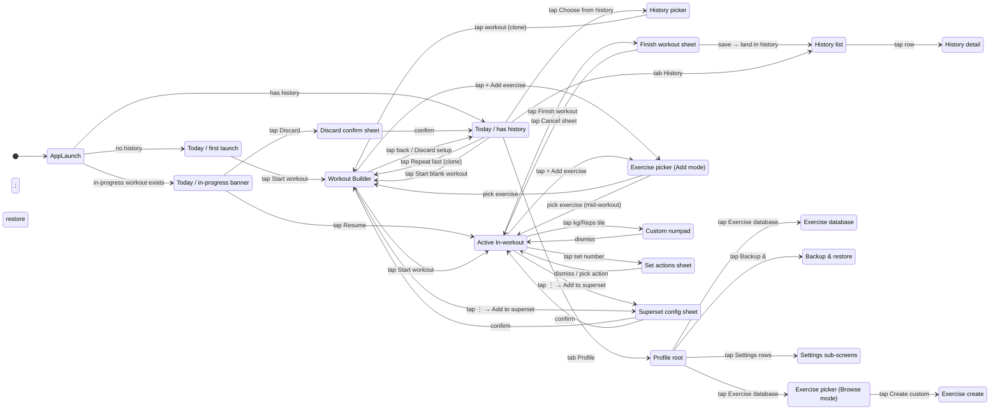
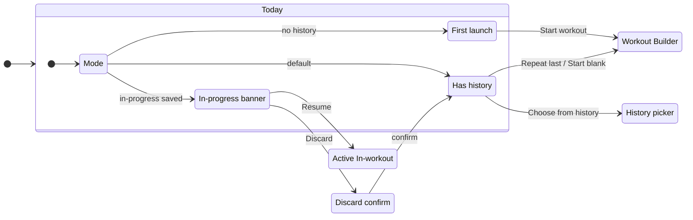

# Kachka · Flow diagram

> Високорівнева мапа усіх екранів v1 і переходів між ними. Кожна нода — окремий wireframe HTML. Кожне ребро — конкретний користувальницький екшн (тап, swipe, тощо).

Читай разом з [INDEX.md](INDEX.md) (статус мокапів) і `../gym-tracker-spec.md` (поведінка).

**Status**: Today batch wired up. Інші ноди — placeholders, активуються по мірі додавання батчів.

---

## Top-level state diagram

---

## Subflows

### Today flow (Batch 1, ✅ wired)

Файли:
- [today-has-history.html](today-has-history.html)
- [today-first.html](today-first.html)
- [today-in-progress.html](today-in-progress.html)

---

## Conventions

### Тригери на ребрах

Описуються коротко, у формі дії. Приклади:
- `tap Repeat last` — простий тап на CTA
- `tap row` — тап на елемент списку
- `swipe down` — gesture
- `long press set` — long-press
- `pick exercise` — вибір з модалки/списку

### Bottom sheets

Confirmation і action sheets рендеряться як окремі ноди (e.g. `Discard confirm`, `Superset config sheet`) — це візуально перекриває попередній екран, але state-machine це окремий стан.

### Modal screens

Workout Builder і Active In-workout — modal full-takeover (per spec §1). У state-машині це звичайні переходи; візуально на phone це slide-up.

---

## Що робить наступна сесія

1. Заповнюй `state` ноди для свого batch-у з конкретними іменами файлів
2. Додавай ребра з тригерами що деталізують екшени
3. Якщо ноди вже є — перевір, чи відкривають вони свій HTML кліком (Mermaid не підтримує клікабельні стейти у `stateDiagram-v2` напряму, тому файли посилаються через текст під діаграмою)
4. Якщо щось не вкладається — перевір з користувачем перш ніж створювати нову конвенцію
